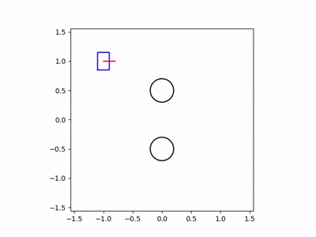

# casadi_mpc应用

## 参考开源项目

[simple_casadi_mpc
](https://github.com/Kotakku/simple_casadi_mpc)

**注意**：请确保已经安装 `casadi` ，安装参考[1_安装CASADI](1_安装CASADI.md)

**安装编译**

```shell
git clone https://github.com/Kotakku/simple_casadi_mpc.git
cd simple_casadi_mpc/
mkdir build
cd build
cmake ..
make -j8
```

**示例运行**

这里提供三个示例

- `diff_drive_mpc_example`
- `double_integrator_mpc_example`
- `inverted_pendulum_mpc_example`

只关注 `diff_drive_mpc_example` 其他示例运行同理

```shell
cd build
./diff_drive_mpc_example
```



## 内容说明

### 需要关注的文件

这里不在关注可视化部分代码，仅考虑MPC的运算内容

- [diff_drive_mpc_example](code/sim_mpc/simple_casadi_mpc/example/diff_drive_mpc_example.cpp)
- [casadi_utils](code/sim_mpc/simple_casadi_mpc/include/simple_casadi_mpc/casadi_utils.hpp)
- [simple_casadi_mpc](code/sim_mpc/simple_casadi_mpc/include/simple_casadi_mpc/simple_casadi_mpc.hpp)

### diff_drive_mpc_example

从 `main` 函数看流程

```cpp
int main() {
    // 问题定义
    auto prob = std::make_shared<DiffDriveProb>();
    // 求解器定义
    MPC mpc(prob);
    // 求解器参数配置
    casadi::DMDict param_list;
    param_list["x_ref"] = {1, -1.0, -M_PI / 2, 0, 0};
    Eigen::VectorXd x(5);
    x << -1, 1, 0, 0, 0;
    const double dt = 0.01;
    const size_t sim_len = 600;
    // 循环仿真
    for (size_t i = 0; i < sim_len; i++) {
        // 求解
        Eigen::VectorXd u = mpc.solve(x, param_list);
        // 仿真
        x = prob->simulate(x, u, dt);
    }
    // 可视化内容
}
```

流程为 `问题定义` - `求解器定义` - `求解器配置` - `循环求解、仿真`，围绕问题和求解器展开

所以我们主要看 `DiffDriveProb` 和 `MPC` 两个类即可

#### DiffDriveProb

`DiffDriveProb` 公共继承 `Problem` 类，作为实例化的类，其本身内容已经很清晰

**运动学方程**

```cpp
    virtual casadi::MX dynamics(casadi::MX x, casadi::MX u) override {
        using namespace casadi;

        auto lacc = u(0);
        auto racc = u(1);
        auto theta = x(2);
        auto v = x(3);
        auto omega = x(4);
        auto vx = v * cos(theta);
        auto vy = v * sin(theta);

        return vertcat(vx, vy, omega, lacc, racc);
    }
```

- 状态向量为 $\mathrm{x} = [x,y,\theta,v,\omega]^T$
- 控制向量为 $\mathrm{u} = [a_v,a_\omega]^T$

$$
\begin{align}
\dot{\mathrm{x}} = \mathrm{f}(\mathrm{x},\mathrm{u})
\end{align}
$$

**目标函数**

目标函数由 `stage_cost` 和 `terminal_cost` 组成

```cpp
    virtual casadi::MX stage_cost(casadi::MX x, casadi::MX u, size_t k) override {
        (void)k;
        using namespace casadi;
        MX L = 0;
        auto e = x - x_ref;
        L += 0.5 * mtimes(e.T(), mtimes(Q, e));
        L += 0.5 * mtimes(u.T(), mtimes(R, u));
        return dt() * L;
    }

    virtual casadi::MX terminal_cost(casadi::MX x) {
        using namespace casadi;
        auto e = x - x_ref;
        return 0.5 * mtimes(e.T(), mtimes(Qf, e));
    }
```

$$
\frac{1}{2}(\mathrm{x}-\mathrm{x_{ref}})^TQ(\mathrm{x}-\mathrm{x_{ref}})+\frac{1}{2}\mathrm{u}^TR\mathrm{u}
$$

终端代价需要单拎出来

$$
\frac{1}{2}(\mathrm{x}-\mathrm{x_{ref}})^TQ_f(\mathrm{x}-\mathrm{x_{ref}})
$$

上述目标函数内容 $\mathrm{x}$ 是决策变量，在优化过程中已经提供，这里需要提前定义/输入以下四个变量

- $Q$ 阶段状态代价矩阵
- $R$ 阶段输入代价矩阵
- $Q_f$ 终端状态代价矩阵
- $\mathrm{x}_{ref}$ 某个时刻所需的参考状态

这四个变量在 `DiffDriveProb` 构造函数时已经定义如下

```cpp
        using namespace casadi;
        x_ref = parameter("x_ref", 5, 1);

        Q = DM::diag({10, 10, 6, 0.5, 0.1});
        R = DM::diag({0.01, 0.01});
        Qf = DM::diag({10, 10, 6, 0.5, 0.1});
```

**添加约束**

约束需要在初始化时进行添加，所以这部分内容也在构造函数中

```cpp
        // 控制输入约束 v \in [-2, 2], w \in [-2, 2]
        Eigen::VectorXd u_ub = (Eigen::VectorXd(2) << 2.0, 2.0).finished();
        Eigen::VectorXd u_lb = -u_ub;
        set_input_bound(u_lb, u_ub);

        // 状态约束
        Eigen::VectorXd x_ub = (Eigen::VectorXd(5) << inf, inf, inf, 2.0, 1.5).finished();
        Eigen::VectorXd x_lb = -x_ub;
        set_state_bound(x_lb, x_ub);
```

- `set_input_bound` 和 `set_state_bound` 为父类函数直接调用即可

这里还考虑了避障约束，障碍物和机器人均简化为圆形

```cpp
        add_constraint(ConstraintType::Inequality,
                       std::bind(&DiffDriveProb::obstacle2, this, std::placeholders::_1, std::placeholders::_2));
        /****/
        casadi::MX obstacle2(casadi::MX x, casadi::MX u) {
        (void)u;
        using namespace casadi;
        casadi::MX xy = x(Slice(0, 2));
        casadi::DM center = casadi::DM::zeros(2);
        center(0) = 0.0;
        center(1) = -0.5;
        casadi::MX radius = 0.4;

        return -(mtimes((xy - center).T(), (xy - center)) - radius * radius);
    }
```

- `add_constraint` 同样是父类中的函数，需要注意配置为 `ConstraintType::Inequality` 不等式约束
  
`DiffDriveProb` 并不多，需要详细查看它父类中的内容

#### Problem

在 `Problem` 类前需要注意几个模板函数

```cpp
template <class T>
static T integrate_dynamics_forward_euler(double dt, T x, T u, std::function<T(T, T)> dynamics) {
    return x + dt * dynamics(x, u);
}

template <class T>
static T integrate_dynamics_modified_euler(double dt, T x, T u, std::function<T(T, T)> dynamics) {
    T k1 = dynamics(x, u);
    T k2 = dynamics(x + dt * k1, u);
    return x + dt * (k1 + k2) / 2;
}

template <class T>
static T integrate_dynamics_rk4(double dt, T x, T u, std::function<T(T, T)> dynamics) {
    T k1 = dynamics(x, u);
    T k2 = dynamics(x + dt / 2 * k1, u);
    T k3 = dynamics(x + dt / 2 * k2, u);
    T k4 = dynamics(x + dt * k3, u);
    return x + dt / 6 * (k1 + 2 * k2 + 2 * k3 + k4);
}
```

分别对应不同的配点方法，参考 [3_梯形配点法](../TrajOpt/3_梯形配点法.md) 和  [4_Hermite–Simpson配点法](../TrajOpt/4_Hermite–Simpson配点法.md)

需要注意的是这里模板函数使用 `static` 修饰，起到以下作用

- 函数作用域被限制在当前 `.cpp` 文件下，避免与其他文件内容命名冲突

##### 枚举类

在 `Problem` 开始部分，有两个枚举类，主要用于配置信息

```cpp
    enum class DynamicsType {
        ContinuesForwardEuler,
        ContinuesModifiedEuler,
        ContinuesRK4,
        Discretized,
    };

    enum class ConstraintType {
        Equality,
        Inequality
    };
```

使用 `enum class` **强枚举类** 有以下优势

- 不允许隐式转换
- `enum class` 的枚举值仅在自身作用域内可见，必须通过 `枚举类名::枚举值` 访问,避免命名冲突

##### 私有变量

首先是问题需要的一些配置信息，`const` 修饰为常量，一旦定义后不可修改

```cpp
    const DynamicsType dyn_type_;
    const size_t nx_;
    const size_t nu_;
    const size_t horizon_;
    const double dt_;
```

- `dyn_type_` 配点类型
- `nx_` 状态向量维度
- `nu_` 控制向量维度
- `horizon_` 预测视野
- `dt_` 时间步长

关于私有变量的获取，类中提供了对应的接口

```cpp
    DynamicsType dynamics_type() const { return dyn_type_; }
    size_t nx() const { return nx_; }
    size_t nu() const { return nu_; }
    size_t horizon() const { return horizon_; }
    double dt() const { return dt_; }
```

使用 `const` 修饰，表示不能修改成员变量

##### 约束函数

使用 `std::function` 擦除具体可调用类型，只暴漏签名对应的接口，即对应格式的输入和输出，方便进行统一管理

```cpp
    using ConstraintFunc = std::function<casadi::MX(casadi::MX, casadi::MX)>;
    std::vector<ConstraintFunc> equality_constrinats_;
    std::vector<ConstraintFunc> inequality_constrinats_;
```

##### 上下界

使用 `std::pair` 来定义上下限

```cpp
    using LUbound = std::pair<Eigen::VectorXd, Eigen::VectorXd>;
    std::vector<LUbound> u_bounds_;
    std::vector<LUbound> x_bounds_;
```

##### 符号参数与数字参数

这里使用 `MXDMPair` 统一管理 `casadi` 的符号参数和数值参数，将 `MX` 与 `DM` 进行绑定

后续使用 `param_list_` 按照字符串进行映射管理

```cpp
    struct MXDMPair {
        casadi::MX mx;
        casadi::DM dm;
    };
    std::map<std::string, MXDMPair> param_list_;
```

同时也定义了一个配套的函数，定义同等大小的 `MX` 和 `DM` 变量

```cpp
    casadi::MX parameter(std::string name, size_t rows, size_t cols) {
        auto param = casadi::MX::sym(name, rows, cols);
        param_list_[name] = {param, casadi::DM::zeros(rows, cols)};
        return param;
    }
```

##### 构造函数

构造函数内容不多，只关注初始化列表内容即可

- 初始化列表内容执行时机早于构造函数体
- 对于 `const` 修饰的成员变量，必须在定义时完成赋值，所以只有在初始化列表时才能执行此操作

##### 上下限配置

主要涉及
- `set_input_bound`
- `set_input_lower_bound`
- `set_input_upper_bound`
- `set_state_bound`
- `set_state_lower_bound`
- `set_state_upper_bound`

比较简单，不多叙述

##### 约束配置

根据约束类型添加到已有的约束函数容器中，需要保持签名一致

```cpp
    void add_constraint(ConstraintType type, std::function<casadi::MX(casadi::MX, casadi::MX)> constrinat) {
        if (type == ConstraintType::Equality) {
            equality_constrinats_.push_back(constrinat);
        } else {
            inequality_constrinats_.push_back(constrinat);
        }
    }
```

具体使用在 `DiffDriveProb` 中

```cpp
add_constraint(ConstraintType::Inequality,
               std::bind(&DiffDriveProb::obstacle1, this, std::placeholders::_1, std::placeholders::_2));
```

将 `DiffDriveProb` 类的成员函数 `obstacle1` 转换为符合 `add_constraint` 要求的 `std::function` 可调用对象，关键逻辑如下：

- 类的非静态成员函数（如 obstacle1）有一个隐藏的第一个参数：this 指针（指向当前类实例）。这意味着直接传递 &DiffDriveProb::obstacle1 时，编译器会报错 —— 因为它缺少 this 指针，无法单独调用。
  
    std::bind 的作用就是显式绑定 this 指针，并将成员函数 “包装” 成一个无隐藏参数的可调用对象，使其符合 std::function<casadi::MX(casadi::MX, casadi::MX)> 的签名（输入 x, u，输出 MX）。

std::bind 参数解析：

    &DiffDriveProb::obstacle1：要绑定的成员函数地址；
    this：绑定当前类实例（DiffDriveProb 的对象），确保调用 obstacle1 时能访问类的成员变量 / 函数；
    std::placeholders::_1、std::placeholders::_2：占位符，分别代表未来调用该可调用对象时传入的第一个参数（x）和第二个参数（u）。

    绑定后，生成的可调用对象可以像普通函数一样被调用：wrapper(x, u) 等价于 this->obstacle1(x, u)。

##### 运动学配置

这里涉及到纯虚函数，因为 `Problem` 目的是构建一个通用父类，所以需要将特殊化的部分通过纯虚函数交给实例化的子类进行处理

```cpp
    virtual casadi::MX dynamics(casadi::MX x, casadi::MX u) = 0;

    Eigen::VectorXd dynamics_eval(Eigen::VectorXd x, Eigen::VectorXd u) {
        casadi::DM x_dm = casadi::DM::zeros(nx(), 1);
        casadi::DM u_dm = casadi::DM::zeros(nu(), 1);
        for (size_t i = 0; i < nx(); i++) {
            x_dm(i) = x[i];
        }
        for (size_t i = 0; i < nu(); i++) {
            u_dm(i) = u[i];
        }
        casadi::MX dx_mx = dynamics(x_dm, u_dm);
        casadi::DM dx_dm = casadi::MX::evalf(dx_mx);
        Eigen::VectorXd dx = casadi_utils::to_eigen(dx_dm);
        return dx;
    }
```

`dynamics_eval` 是 `Eigen` 与 `Casadi` 的桥梁，其中也调用了未实例化的 `dynamics` 纯虚函数

动力学仿真提供了两个接口，第一个为离散动力学仿真

$$
\mathrm{x}_{k+1}=\mathrm{f}(\mathrm{x}_k, \mathrm{u}_k)
$$

直接计算得到下一时刻状态

第二个为连续运动学仿真(离散逼近)

提供多种配点接口

```cpp
    Eigen::VectorXd simulate(Eigen::VectorXd x0, Eigen::MatrixXd u) {
        assert(dyn_type_ == DynamicsType::Discretized);
        return dynamics_eval(x0, u);
    }

    Eigen::VectorXd simulate(Eigen::VectorXd x0, Eigen::MatrixXd u, double dt) {
        assert(dyn_type_ != DynamicsType::Discretized);
        auto dyn = std::bind(&Problem::dynamics_eval, this, std::placeholders::_1, std::placeholders::_2);
        switch (dyn_type_) {
        case DynamicsType::ContinuesForwardEuler:
            return integrate_dynamics_forward_euler<Eigen::VectorXd>(dt, x0, u, dyn);
            break;
        case DynamicsType::ContinuesModifiedEuler:
            return integrate_dynamics_modified_euler<Eigen::VectorXd>(dt, x0, u, dyn);
            break;
        case DynamicsType::ContinuesRK4:
            return integrate_dynamics_rk4<Eigen::VectorXd>(dt, x0, u, dyn);
            break;
        case DynamicsType::Discretized:
            break;
        }
        return x0;
    }
```

##### 目标函数

目标函数涉及 `stage_cost` 和 `terminal_cost`

这里提供的是虚函数，虽然不重写也可以运行，但默认返回的均是0，肯定是无法正常运行的

```cpp
    // k番目のステージコスト
    virtual casadi::MX stage_cost(casadi::MX x, casadi::MX u, size_t k) {
        (void)x;
        (void)u;
        (void)k;
        return 0;
    }

    // 終端のコスト
    virtual casadi::MX terminal_cost(casadi::MX x) {
        (void)x;
        return 0;
    }
```

#### MPC

整个类只有构造函数和求解函数

首先定义了三个静态成员函数，用于配置求解器的默认参数

- `default_ipopt_config`
- `default_qpoases_config`
- `default_fatrop_config`

>在 CasADi 库中，casadi::Dict 是一种键值对（key-value）容器类型，本质上是一个 “通用字典”，用于存储和传递各种类型的参数、配置选项或数据。它的作用类似于 Python 中的 dict、C++ 标准库中的 std::map<std::string, casadi::GenericType>，但专为 CasADi 的符号计算和优化求解场景设计，支持更灵活的类型存储。

##### 私有变量

##### 构造函数

```cpp
template <class T>
MPC(
std::shared_ptr<T> prob,
std::string solver_name = "ipopt", 
casadi::Dict config = default_ipopt_config()
) : prob_(prob), solver_name_(solver_name), config_(config)
```

这里有个很巧妙地设计，回到 `diff_drive_mpc_example` 的 `main` 中

```cpp
auto prob = std::make_shared<DiffDriveProb>();
MPC mpc(prob);
```

这里传入的是 `Problem` 派生类 `DiffDriveProb` 的智能指针，

而在MPC构造前通过初始化列表，将其赋值给

```cpp
std::shared_ptr<Problem> prob_;
```

这里是派生类的智能指针赋值给基类共享指针，这样做的好处是

- 实现多态调用：基类接口统一访问派生类实现

> std::shared_ptr<DiffDriveProb> 可以隐式转换为 std::shared_ptr<Problem>（基类指针），而 Problem 类中定义了纯虚函数接口(dynamics); 这意味着：在 MPC 类中，只需通过基类指针 prob_ 调用 prob_->dynamics(x, u)，就能自动匹配到 DiffDriveProb 中重写的具体实现（如差动驱动机器人的动力学模型），而无需 MPC 类知道 “当前处理的是哪种具体问题”。

- 依赖倒置原则：高层模块依赖抽象而非具体

> MPC 类作为 “优化求解器”（高层模块），其核心逻辑是 “如何求解优化问题”，而不是 “求解哪种具体问题”。
通过将派生类指针转换为基类指针，MPC 类的代码仅依赖 Problem 基类的抽象接口，不依赖任何具体派生类（如 DiffDriveProb）。带来的直接好处是：当具体问题类（如 DiffDriveProb）需要修改时（如调整动力学模型），MPC 类的代码无需任何改动；当需要新增问题类型时（如倒立摆问题），只需新增一个 Problem 派生类，MPC 类可直接兼容。


具体过程
1. 类的虚表构建
Problem 基类中定义了纯虚函数 virtual casadi::MX dynamics(...) = 0;，因此 Problem 会有一个虚表，其中 dynamics 条目暂时为空（纯虚函数无实现）。
DiffDriveProb 派生类重写了 dynamics 函数（提供具体实现），因此 DiffDriveProb 的虚表会：
先复制 Problem 虚表的结构；
将 dynamics 条目的地址替换为 DiffDriveProb::dynamics 的实际函数地址。
2. 对象的虚表指针（vptr）指向当执行 auto prob = std::make_shared<DiffDriveProb>(); 时：创建了一个 DiffDriveProb 类型的对象，该对象的 vptr 会自动指向 DiffDriveProb 的虚表（而非 Problem 的虚表）。
3. 基类指针调用虚函数时的多态实现
当 DiffDriveProb 的 shared_ptr 转换为 shared_ptr<Problem> 并存储到 prob_ 后，MPC 类通过 prob_->dynamics(x, u) 调用函数时：编译器知道 dynamics 是虚函数，因此不会直接绑定函数地址，而是通过对象的 vptr 查找虚表；
prob_ 指向的实际是 DiffDriveProb 对象，其 vptr 指向 DiffDriveProb 的虚表；
从 DiffDriveProb 的虚表中找到 dynamics 条目对应的地址（即 DiffDriveProb::dynamics 的实现），最终调用派生类的函数。

###### casadi 格式展开

```cpp
    static_assert(std::is_base_of_v<Problem, T>, "prob must be based SimpleProb");

    const size_t nx = prob_->nx();
    const size_t nu = prob_->nu();
    const size_t N = prob_->horizon();

    Xs.reserve(N + 1);
    Us.reserve(N);

    for (size_t i = 0; i < N; i++) {
        Xs.push_back(MX::sym("X_" + std::to_string(i), nx, 1));
        Us.push_back(MX::sym("U_" + std::to_string(i), nu, 1));
    }
    Xs.push_back(MX::sym("X_" + std::to_string(N), nx, 1));
```

入口处进行一次断言，在编译阶段强制检查模板参数 T 是否是 Problem 类的派生类

记录问题的相关参数

- `nx` 状态向量维度
- `nu` 控制向量维度
- `N` 预测视野

初始化 `Xs` 和 `Us` (std::vector\<casadi::MX\>)，`Xs` 比 `Us` 数量上多一个，因为控制施加在两个相邻状态之间

###### 动力学方程绑定

```cpp
        std::function<casadi::MX(casadi::MX, casadi::MX)> dynamics;
        switch (prob_->dynamics_type()) {
        case Problem::DynamicsType::ContinuesForwardEuler: {
            std::function<casadi::MX(casadi::MX, casadi::MX)> con_dyn =
                std::bind(&Problem::dynamics, prob_, std::placeholders::_1, std::placeholders::_2);
            dynamics = std::bind(integrate_dynamics_forward_euler<casadi::MX>, prob_->dt(), std::placeholders::_1, std::placeholders::_2, con_dyn);
            break;
        }
        case Problem::DynamicsType::ContinuesModifiedEuler: {
            std::function<casadi::MX(casadi::MX, casadi::MX)> con_dyn =
                std::bind(&Problem::dynamics, prob_, std::placeholders::_1, std::placeholders::_2);
            dynamics = std::bind(integrate_dynamics_modified_euler<casadi::MX>, prob_->dt(), std::placeholders::_1, std::placeholders::_2, con_dyn);
            break;
        }
        case Problem::DynamicsType::ContinuesRK4: {
            std::function<casadi::MX(casadi::MX, casadi::MX)> con_dyn =
                std::bind(&Problem::dynamics, prob_, std::placeholders::_1, std::placeholders::_2);
            dynamics = std::bind(integrate_dynamics_rk4<casadi::MX>, prob_->dt(), std::placeholders::_1, std::placeholders::_2, con_dyn);
            break;
        }
        case Problem::DynamicsType::Discretized:
            dynamics = std::bind(&Problem::dynamics, prob_, std::placeholders::_1, std::placeholders::_2);
            break;
        }
```


## 参考

- [simple_casadi_mpc
](https://github.com/Kotakku/simple_casadi_mpc)