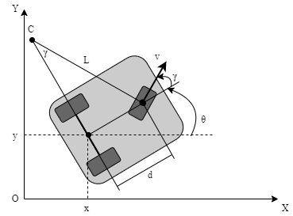
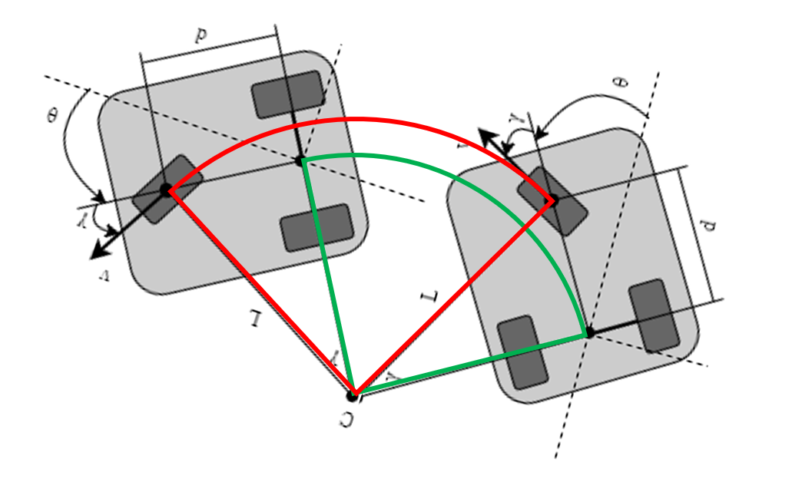

# 前驱三轮底盘动力学



状态向量为

$X=[x,y,\theta]^T$

控制输入

$u=[v_f,\gamma]^T$

其中

- $x,y$ 为全局坐标，

- $\theta$ 为车辆整体方位角

- $\gamma$ 为车辆前轮的转向角

- $v_f$ 为前轮线速度

**系统方程如下：**

$$
\begin{align}
\dot{x}&=v_fcos\gamma cos\theta\\
\dot{y}&=v_fcos\gamma sin\theta\\
\dot{\theta}&=\frac{v_f sin\gamma}{d}\\
\end{align}
$$

或者写为

$$
\begin{align}
v&=v_fcos\gamma\\
\dot{\theta}&=\frac{v_f sin\gamma}{d}\\
\end{align}
$$

$d$ 为前驱动轮与后轮轴线的垂直距离。

## 两相邻位姿间的运动学关系



给定后轮轴心相邻位姿

$$
\mathbf{P}_1 = \begin{bmatrix} x_1 \\ y_1 \\ \theta_1 \end{bmatrix}, \quad
\mathbf{P}_2 = \begin{bmatrix} x_2 \\ y_2 \\ \theta_2 \end{bmatrix}
$$

时间间隔 $\Delta T$，且假设 $\gamma$ 恒定。

### 几何量定义

- **转向角度**：$\Delta\theta = \theta_2 - \theta_1$

### 后轮轴心轨迹

- **弦长**：$s = \|\mathbf{P}_{2,xy}-\mathbf{P}_{1,xy}\|$
- **转向半径**：$R = \dfrac{s}{2sin\frac{\Delta\theta}{2}}$
- **弧长**：$L = R \cdot \Delta\theta$

### 前轮轴心轨迹

将后轮位姿平移至前轮：

$$
\mathbf{P}_i^f = \mathbf{P}_i + d\begin{bmatrix} \cos\theta_i \\ \sin\theta_i \end{bmatrix}, \quad i=1,2
$$

- **弦长**：$s^f = \|\mathbf{P}_{2,xy}^f - \mathbf{P}_{1,xy}^f\|$
- **前轮转向半径**：$R^f = \dfrac{s^f}{2sin\frac{\Delta\theta}{2}}$
- **前轮弧长**：$L^f = R^f \cdot \Delta\theta$

## TEB 约束 edge 的修改

### 速度 edge

文件 `edge_velocity.h`

<details>
<summary>edge_velocity</summary>
<pre><code class="language-cpp">
    void computeError()
    {
      ROS_ASSERT_MSG(cfg_, "You must call setTebConfig on EdgeVelocity()");
      const VertexPose *conf1 = static_cast<const VertexPose *>(_vertices[0]);
      const VertexPose *conf2 = static_cast<const VertexPose *>(_vertices[1]);
      const VertexTimeDiff *deltaT = static_cast<const VertexTimeDiff *>(_vertices[2]);

      // 提取原始位姿
      const double d = 0.2;
      const auto &pose1_raw = conf1->estimate();
      const auto &pose2_raw = conf2->estimate();

      // 计算前轮修正后的位姿
      Eigen::Vector2d pose1_front(
          pose1_raw.x() + d * std::cos(pose1_raw.theta()),
          pose1_raw.y() + d * std::sin(pose1_raw.theta()));

      Eigen::Vector2d pose2_front(
          pose2_raw.x() + d * std::cos(pose2_raw.theta()),
          pose2_raw.y() + d * std::sin(pose2_raw.theta()));

      // 计算修正后的位移差
      Eigen::Vector2d deltaS = pose2_front - pose1_front;

      // 直线距离
      double dist = deltaS.norm();
      const double angle_diff = g2o::normalize_theta(conf2->theta() - conf1->theta());

      if (cfg_->trajectory.exact_arc_length && angle_diff >= 1e-4)
      {
        // 计算前轮旋转半径
        double radius = dist / (2 * sin(angle_diff / 2));
        // 计算前轮行驶弧长
        dist = fabs(angle_diff * radius);
      }
      // 计算前轮线速度m/s
      double vel = dist / deltaT->estimate();
      // 确定速度方向
      vel *= g2o::sign(deltaS[0] * cos(conf1->theta()) + deltaS[1] * sin(conf1->theta())); // consider direction
      // 计算旋转角速度
      double omega = angle_diff / deltaT->estimate();
      // 计算后轮位移差
      deltaS = pose2_raw.position() - pose1_raw.position();
      double gamma = 0;
      if (angle_diff >= 1e-4)
      {
        // 计算后轮旋转半径
        double r = (deltaS.norm() / 2.0) / std::sin(angle_diff / 2.0);
        // 计算前轮转向角
        gamma = std::atan(d / r) * g2o::sign(angle_diff);
      }

      _error[0] = penaltyBoundToInterval(vel, -cfg_->robot.max_vel_x_backwards, cfg_->robot.max_vel_x, cfg_->optim.penalty_epsilon);
      _error[1] = penaltyBoundToInterval(gamma, cfg_->robot.max_vel_theta, cfg_->optim.penalty_epsilon);

      ROS_ASSERT_MSG(std::isfinite(_error[0]), "EdgeVelocity::computeError() _error[0]=%f _error[1]=%f\n", _error[0], _error[1]);
    }

</code></pre>

</details>

### 加速度 edge

文件 `edge_acceleration.h`

<details>
<summary>edge_velocity</summary>
<pre><code class="language-cpp">
void computeError()
    {
      ROS_ASSERT_MSG(cfg_, "You must call setTebConfig on EdgeAcceleration()");
      const VertexPose *pose1 = static_cast<const VertexPose *>(_vertices[0]);
      const VertexPose *pose2 = static_cast<const VertexPose *>(_vertices[1]);
      const VertexPose *pose3 = static_cast<const VertexPose *>(_vertices[2]);
      const VertexTimeDiff *dt1 = static_cast<const VertexTimeDiff *>(_vertices[3]);
      const VertexTimeDiff *dt2 = static_cast<const VertexTimeDiff *>(_vertices[4]);

      // 提取原始位姿
      const double d = 0.2;
      const auto &pose1_raw = pose1->estimate();
      const auto &pose2_raw = pose2->estimate();
      const auto &pose3_raw = pose3->estimate();

      // 计算前端修正后的位姿
      Eigen::Vector2d pose1_front(
          pose1_raw.x() + d * std::cos(pose1_raw.theta()),
          pose1_raw.y() + d * std::sin(pose1_raw.theta()));

      Eigen::Vector2d pose2_front(
          pose2_raw.x() + d * std::cos(pose2_raw.theta()),
          pose2_raw.y() + d * std::sin(pose2_raw.theta()));

      Eigen::Vector2d pose3_front(
          pose3_raw.x() + d * std::cos(pose3_raw.theta()),
          pose3_raw.y() + d * std::sin(pose3_raw.theta()));

      // 计算前轮位置差
      const Eigen::Vector2d diff1 = pose2_front - pose1_front;
      const Eigen::Vector2d diff2 = pose3_front - pose2_front;

      double dist1 = diff1.norm();
      double dist2 = diff2.norm();
      // 计算角度差
      const double angle_diff1 = g2o::normalize_theta(pose2->theta() - pose1->theta());
      const double angle_diff2 = g2o::normalize_theta(pose3->theta() - pose2->theta());

      if (cfg_->trajectory.exact_arc_length)
      {
        if (angle_diff1 >= 1e-4)
        {
          const double radius = dist1 / (2 * sin(angle_diff1 / 2));
          dist1 = fabs(angle_diff1 * radius);
        }
        if (angle_diff2 >= 1e-4)
        {
          const double radius = dist2 / (2 * sin(angle_diff2 / 2));
          dist2 = fabs(angle_diff2 * radius);
        }
      }
      // 计算前轮线速度m/s
      double vel1 = dist1 / dt1->dt();
      double vel2 = dist2 / dt2->dt();

      // 确定速度方向
      vel1 *= g2o::sign(diff1[0] * cos(pose1->theta()) + diff1[1] * sin(pose1->theta()));
      vel2 *= g2o::sign(diff2[0] * cos(pose2->theta()) + diff2[1] * sin(pose2->theta()));
      // 计算前轮加速度 m/s/s
      const double acc_lin = (vel2 - vel1) * 2 / (dt1->dt() + dt2->dt());
      // 计算后轮角速度
      const double omega1 = angle_diff1 / dt1->dt();
      const double omega2 = angle_diff2 / dt2->dt();
      // 计算前轮转向角度
      double gamma1 = 0;
      double gamma2 = 0;
      if (angle_diff1 >= 1e-4)
      {
        double r1 = (diff1.norm() / 2.0) / std::sin(angle_diff1 / 2.0);
        gamma1 = std::atan(d / r1) * g2o::sign(angle_diff1);
      }
      if (angle_diff2 >= 1e-4)
      {
        double r2 = (diff2.norm() / 2.0) / std::sin(angle_diff2 / 2.0);
        gamma2 = std::atan(d / r2) * g2o::sign(angle_diff2);
      }
      // 计算前轮转向角速度 rad/s
      const double gam_v = (gamma2 - gamma1) * 2 / (dt1->dt() + dt2->dt());

      _error[0] = penaltyBoundToInterval(acc_lin, cfg_->robot.acc_lim_x, cfg_->optim.penalty_epsilon);
      _error[1] = penaltyBoundToInterval(gam_v, cfg_->robot.acc_lim_theta, cfg_->optim.penalty_epsilon);

      ROS_ASSERT_MSG(std::isfinite(_error[0]), "EdgeAcceleration::computeError() translational: _error[0]=%f\n", _error[0]);
      ROS_ASSERT_MSG(std::isfinite(_error[1]), "EdgeAcceleration::computeError() rotational: _error[1]=%f\n", _error[1]);
    }

</code></pre>

</details>

## 控制量反算

## 问题

```shell
[INFO] [1753977768.547029815, 103.424000000]: optimizeGraph(): Optimization iter=7
iteration= 0     chi2= 26.480399         time= 0.000140942       cumTime= 0.000140942    edges= 20       schur= 0        lambda= 2908669164619.518066    levenbergIter= 1
iteration= 1     chi2= 26.480399         time= 7.2478e-05        cumTime= 0.00021342     edges= 20       schur= 0        lambda= 1939112776413.011963    levenbergIter= 1
iteration= 2     chi2= 26.480399         time= 7.1084e-05        cumTime= 0.000284504    edges= 20       schur= 0        lambda= 1292741850942.007812    levenbergIter= 1
iteration= 3     chi2= 26.480399         time= 6.3489e-05        cumTime= 0.000347993    edges= 20       schur= 0        lambda= 861827900628.005127     levenbergIter= 1
iteration= 4     chi2= 26.480399         time= 6.553e-05         cumTime= 0.000413523    edges= 20       schur= 0        lambda= 574551933752.003418     levenbergIter= 1
iteration= 5     chi2= 26.480399         time= 7.2253e-05        cumTime= 0.000485776    edges= 20       schur= 0        lambda= 383034622501.335571     levenbergIter= 1
iteration= 6     chi2= 26.480399         time= 6.8598e-05        cumTime= 0.000554374    edges= 20       schur= 0        lambda= 255356415000.890381     levenbergIter= 1
```

$lambda$值异常巨大
$lambda=279951946985842702469300224.000000$（约 2.8×10²⁶），这是 LM 算法中的阻尼系数，用于平衡高斯 - 牛顿步（二阶近似）和梯度下降步（一阶近似）。
$lambda$越大，算法越接近 “梯度下降”，步长被严重压缩（甚至接近零），导致参数更新量极小或为零。
日志中$chi2$（目标函数值，残差平方和）从 51.3 小幅降至 49.2 后不再变化，说明参数未被有效调整，目标函数几乎未优化。
$levenbergIter=9$
这表示在每次优化迭代中，LM 算法的阻尼系数调整次数达到上限（通常为尝试减小$lambda$以获得可接受的步长）。但最终仍未找到合适的$lambda$，导致步长无效（无法降低$chi2$）。

## 输出转换&约束转换

原始 TEB 的输出为相对后轮轴心的一系列位姿 $\{pose_1,pose_2,...\}$

但是由于控制对象是前轮,所以需要将后轮轴心位姿转换为前驱轮的 $v,\gamma$

此外,也需要将前轮的约束转换为整体的约束,

所以修改包括两个内容

- 后轮轴心位姿转换为前驱轮控制量
- 前驱轮转换为后轮轴心约束

### 后轮轴心位姿转换为前驱轮控制量

**前轮线速度**：$v_f = \dfrac{L^f}{\Delta T}$

- $L^f$ 为前轮弧长

**前轮转角**：

当前轮转向角为 $\gamma = \plusmn 90°$ 时，运动学模型退化为

$$
\begin{align}
\dot{x}&=0\\
\dot{y}&=0\\
\dot{\theta}&=\frac{v_f}{d}\\
\end{align}
$$

完全退化为一个纯旋转运动，为了适用这种退化，使用如下公式反推转向角

$$
\gamma = atan(\frac{\omega d}{v})
$$

> 当前轮转角允许范围在 $-\pi/2\sim\pi/2$ 时

需要考虑到特殊情况

- $\gamma$ 等于正负 $90°$
  
  这也是转向角使用 $atan$ 的原因，因为其值域在 $[-\pi/2,\pi/2]$ 范围内，符合转向角范围；
  
  但需要注意此时的 $v$ 极小，因为近似为纯旋转运动；也仍需注意 $v_f$ 这时取决于前轮的弧长，而前轮弧长又取决于整体的转向角 $\Delta \theta$，这时的难点在于 $v_f$ 的判定，因为相邻位姿的 $pose$ 极其接近，如果定位出现噪声，极其容易引起 $v_f$ 符号的突变，所以当两个相邻位姿接近时，需要更换 $v_f$ 符号的判定方式

  在此之前，需要明确车辆整体的旋转方向由前轮转角和前轮线速度的方向决定，为了简化过程，这里简化 $\gamma$ 方向的获取，这样可以解决极端情况下原运动学模型和退化后模型的衔接问题

  $$
  \gamma = atan(\frac{\omega d}{||v||})
  $$ 

  即 $\gamma$ 方向完全由，$\omega$ 决定，即使 $||v||=0$ 也不会影响 $\gamma$ 符号的判定 

  在此基础上，$v_f$ 符号的判定，完全可以交予两个相邻前轮位姿来计算

```cpp
  void TebOptimalPlanner::extractVelocity(const PoseSE2 &pose1, const PoseSE2 &pose2, double dt, double &vx, double &vy, double &omega) const
  {
    if (dt == 0)
    {
      vx = 0;
      vy = 0;
      omega = 0;
      return;
    }
    /* */
    const double d = 0.2;
    const auto &pose1_raw = pose1;
    const auto &pose2_raw = pose2;
    // const auto &pose1_raw = PoseSE2(0,0, 0.0);
    // const auto &pose2_raw = PoseSE2(0,0, -0.5);
    // 计算前端修正后的位姿
    Eigen::Vector2d pose1_front(
        pose1_raw.x() + d * std::cos(pose1_raw.theta()),
        pose1_raw.y() + d * std::sin(pose1_raw.theta()));

    Eigen::Vector2d pose2_front(
        pose2_raw.x() + d * std::cos(pose2_raw.theta()),
        pose2_raw.y() + d * std::sin(pose2_raw.theta()));
    const Eigen::Vector2d deltaS = pose2_front - pose1_front;

    // 计算前轮弧长
    double dist = deltaS.norm();
    double angle_diff = g2o::normalize_theta(pose2_raw.theta() - pose1_raw.theta());
    if (angle_diff > 1e-4)
    {
      double radius = dist / (2 * sin(angle_diff / 2));
      dist = fabs(angle_diff * radius); 
    }

    // 计算前轮线速度(绝对值)
    double vf = dist / dt;

    // 计算转向角(已经确定方向)
    Eigen::Vector2d deltaS_rear = pose2_raw.position() - pose1_raw.position();
    omega = angle_diff / dt;
    double vel = deltaS_rear.norm() / dt;
    if(vel < 1e-4) vel = 1e-4; // 防止除零
    double gamma = std::atan(omega * d / vel);

    // 使用前轮位姿判断前轮线速度方向
    double direction = deltaS.dot(Eigen::Vector2d(
        std::cos(pose1_raw.theta()+gamma),
        std::sin(pose1_raw.theta()+gamma)));
    vf *= (direction >= 0) ? 1.0 : -1.0;

    ROS_INFO("dir: %.2f,vf: %.2f,vel: %.2f,omega: %.2f,gamma: %.2f",direction,vf,vel,omega,gamma);

    vx = vf;
    omega = gamma;
  }
```

### 后续问题

后续硬件组安装前轮刹车，使得前轮减速的响应极好。

而TEB本身作为一种相对不严格的非线性最小二乘问题，其输出的位姿也会出现轻微跳变，进而导致输出控制指令可能出现极短暂的符号跳变，未加刹车前，可以依靠物理惯性忽略这个跳变，但安装完刹车后，极短的符号跳变得到实车的响应，进而实车大幅转向过程中出现抖动，无法正常进行大幅度转向。

参考:

- [tricyclEbot](https://github.com/kuralme/tricyclEbot)

- [tricycle_robot](https://github.com/duynamrcv/tricycle_robot)
