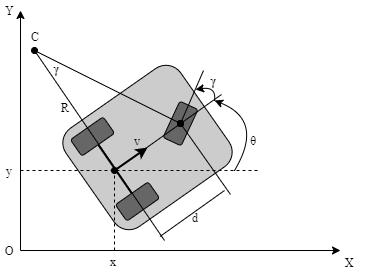

# 后驱三轮底盘动力学

状态向量为

$X=[x,y,\theta,\dot{x},\dot{y},\dot{\theta}]^T$

控制输入

$u=[v,\theta]^T$

其中 $x,y$ 为全局坐标，

$\theta$ 为车辆整体方位角

$\gamma$ 为车辆前轮的转向角

**系统方程如下：**

$$
\begin{align}
\dot{x}&=vcos\theta\\
\dot{y}&=vsin\theta\\
\dot{\theta}&=\frac{vtan\gamma}{d}\\
\end{align}
$$

$d$ 为前驱动轮与后轮轴线的垂直距离。

参考:

[tricyclEbot](https://github.com/kuralme/tricyclEbot)

[tricycle_robot](https://github.com/duynamrcv/tricycle_robot)