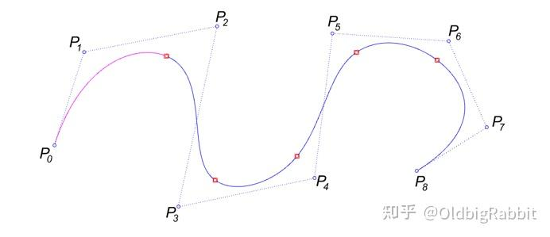
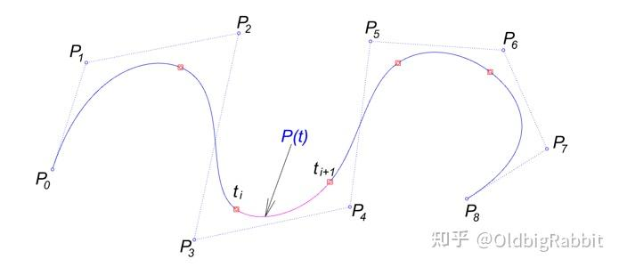
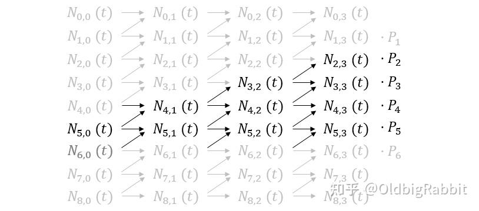
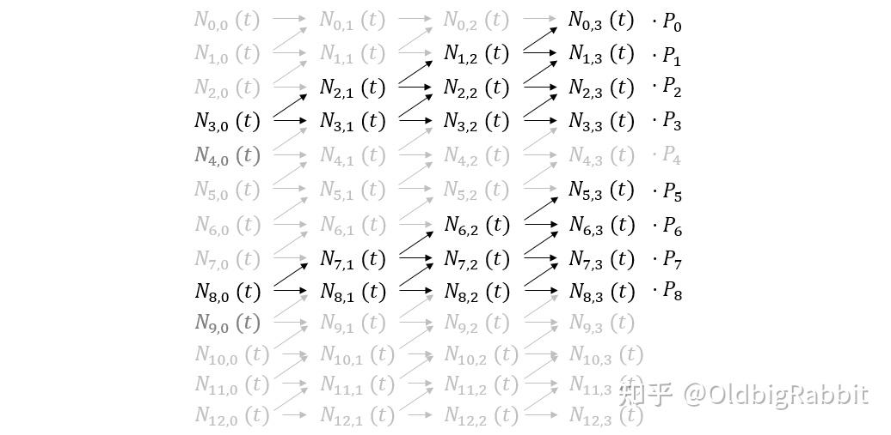
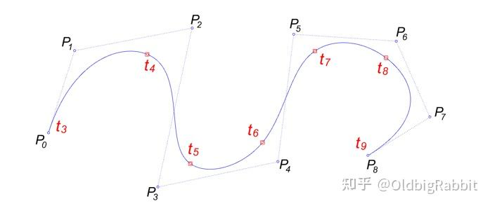
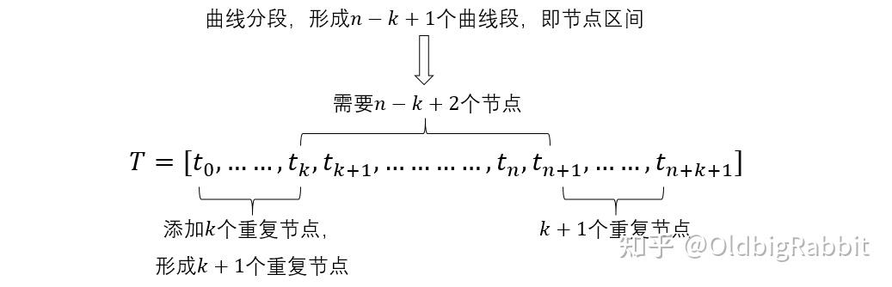

# B样条

> B 样条不是插值曲线，同样具有局部性，并且光滑性更好。

B样条的核心是基函数（basis functions）。给定控制点点列 $\{P_1,P_2,\cdots,P_m\}$ 的 $n$ 次B样条曲线可以表达为：

$$
P(t)=\sum_{i=0}^m N_{i,n}(t)P_i
$$

基函数

$$
\begin{aligned}
N_{i,0}(t)&=
\left\{
\begin{aligned}
&1,&t\in[t_i,t_{i+1})\\
&0,&otherwise
\end{aligned}
\right.\\
N_{i,k}(t)&=\frac{t-t_i}{t_{i+k}-t_i}N_{i,k-1}(t)+\frac{t_{i+k+1}-t}{t_{i+k+1}-t_{i+1}}N_{i+1,k-1}(t)
\end{aligned}
$$

- **控制点数量**：即 $P_i$ 的数量，此处为 $m$

- **阶数**：拟合曲线多项式的最高次方，如： $at^3+bt^2+ct+d$ 的阶数为 $3$

## 示例

给的长度为 $\{P_0,P_1,\cdots,P_8\}$ 点序列,设计为 $3$ 阶 $9$ 个控制点的B样条曲线

而三阶多项式拟合需要四个控制点，

按照点的顺序来看

- $P_0,\cdots,P_3$ 对应第一段拟合曲线
- $P_1,\cdots,P_4$ 对应第二段拟合曲线
- $P_2,\cdots,P_5$ 对应第三段拟合曲线
- $P_3,\cdots,P_6$ 对应第四段拟合曲线
- $P_4,\cdots,P_7$ 对应第五段拟合曲线
- $P_5,\cdots,P_8$ 对应第六段拟合曲线

如下图

可以得出结论，曲线的分段数为 $n-k+1$

> B样条曲线的初衷就是将控制点进行分组、在组内采用 $k$ 阶多项式曲线进行拟合，这是一条3阶曲线，因此曲线的每段恰需4个控制点。当某个点发生变化时，仅影响其对应的分段曲线。

**那B样条是如何控制分段的呢？**

我们回看基函数内容

$$
\begin{aligned}
N_{i,0}(t)&=
\left\{
\begin{aligned}
&1,&t\in[t_i,t_{i+1})\\
&0,&otherwise
\end{aligned}
\right.\\
N_{i,k}(t)&=\frac{t-t_i}{t_{i+k}-t_i}N_{i,k-1}(t)+\frac{t_{i+k+1}-t}{t_{i+k+1}-t_{i+1}}N_{i+1,k-1}(t)
\end{aligned}
$$

在 $0$ 阶计算时候 $t\in[t_i,t_{i+1})$ 直接决定了 $0$ 阶基函数值，并传递到高阶，进而根据当前 $t$ 的范围限制控制点的范围

如下图中的第三段

其对应的控制点应为 $P_2,\cdots,P_5$

也就是说

$$
P(t)=\sum_{i=0}^m N_{i,n}(t)P_i
$$

中要求除去 $N_{2,3}(t),N_{3,3}(t),\cdots,N_{5,3}(t)$ 的基函数均应当为0,这样其他控制点才不会影响第三段曲线

由上图基函数递推关系可以看出，仅当 $N_{5,0}=1$ 时才对应第三段曲线，即对应 $t$ 在区间 $t\in[t_5,t_6)$内

推广到全阶段

最后，该曲线分段及节点的分布如下图

所以设置的节点

$$
T=[t_0,t_1,\cdots,t_{12}]
$$

仅有 $t_3\sim t_8$ 会影响曲线，所以具体设置如下

$$
T=[0, 0, 0, 0, 0.2, 0.4, 0.6, 0.8, 0.9, 1, 1, 1, 1]
$$

至此，我们可以总结节点向量的构成。对于一条由个 $n+1$ 控制点（即控制点最大编号为 $n$ ）的 $k$ 阶曲线，其节点向量构成如下：

## 参考

- [B样条](https://vcl-pku.github.io/vci-book/getting-started/curves/curve-spline.html)
- [B样条曲线和Nurbs曲线 图文并茂的理解节点和节点区间](https://zhuanlan.zhihu.com/p/686518292)