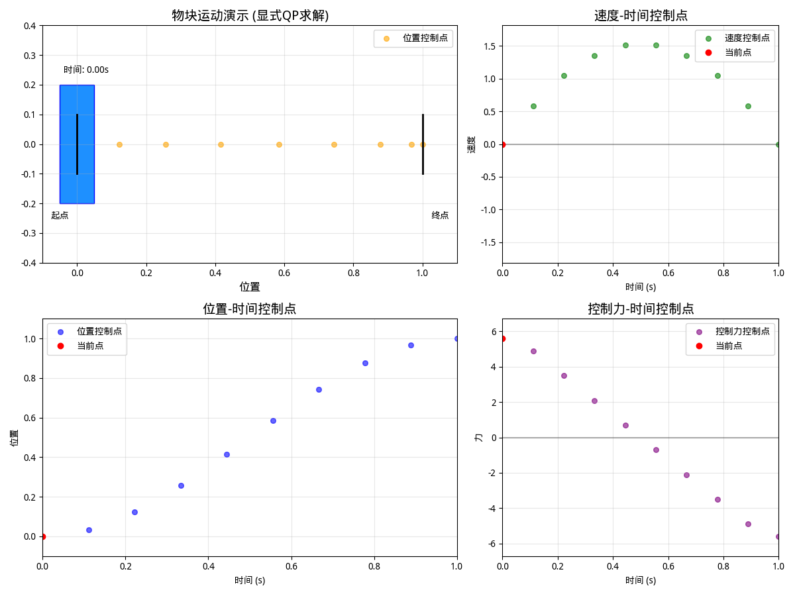

# 移动物块示例

沿用 [1\_轨迹优化简介.md](1_轨迹优化简介.md) 例子

我们以一个简单场景为研究对象：在固定时间内，让一个物块在两点之间移动，且要求物块在起点和终点时保持静止。

为分析这一问题，首先对物块进行动力学建模：

- 将物块简化为一维空间中移动的点；

- 系统的控制输入为施加在物块上的力；

- 用$x$表示物块的位置，$v$表示速度，$u$表示控制力，其动力学关系可描述为：

$$
\begin{align}
\dot{x}=v,\quad u=\dot{v}
\end{align}
$$

### 约束条件

针对 “1 秒内移动指定距离，且起点和终点静止” 的要求，该问题存在以下约束：

$$
\begin{align}
x(0)=0,\quad x(1)=1\\
v(0)=0,\quad v(1)=0
\end{align}
$$

### 目标函数

**最小力平方**：

$$
\begin{align}
\underset{u(t),x(t),v(t)}{\min} \int_0^1u^2(\tau)d\tau
\end{align}
$$

该目标函数旨在最小化控制力的平方在整个运动过程中的积分，可理解为追求更 “平稳” 的控制力。

## 梯形配点

首先需要将原始的连续时间问题转化为非线性规划。

我们需要将轨迹离散化，从而得到一组有限的决策变量。

这可以通过将连续位置 $x(t)$ 和速度 $v(t)$ 表示为它们在特定时间点（称为搭配点）的值来实现：

$$
\begin{align}
&t \rightarrow t_0 ... t_k ... t_N\\
&x \rightarrow x_0 ... x_k ... x_N \\
&v \rightarrow v_0 ... v_k ... v_N
\end{align}
$$

该系统的运动学约束较为简单

$$
\begin{align}
\dot{x}&=v\\
\int_{t_{k}}^{t_{k+1}}\dot{x}dt&=\int_{t_{k}}^{t_{k+1}}vdt
\end{align}
$$

核心是将速度与位移变化联系起来

但是轨迹已经被离散为 $N$ 个配置点，显然连续的约束不再适用，所以将该约束离散化，如下：

$$
x_{k+1}-x_{k}\approx h_k \frac{v_{k+1}+v_k}{2}
$$

> 注： $h_k=t_{k+1}-t_k$
> 把速度曲线切成窄条，每条的面积就是一小段路程。
> 矩形法只用左端或右端一个速度值当“高”，像用一块平砖去填斜坡，误差大。
> 梯形法把两端速度平均后当“高”，相当于用一块斜砖去贴合原曲线，留下的空隙更小，因而更准。

继续将其应用于速度方程，我们便得到一组可在每对配点之间近似系统运动学的方程。这些约束称为**配点约束**，并在整条轨迹的每一段 $ k = 0,\dots,N-1 $ 上强制执行

$$
\begin{align}
x_{k+1}-x_{k}&=h_k\frac{v_{k+1}-v_{k}}{2}\\
v_{k+1}-v_{k}&=h_k\frac{u_{k+1}-u_{k}}{2}
\end{align}
$$

边界条件较为简单，直接固定即可

$$
\begin{align}
x_0=0,\quad x_N=1\\
v_0=0, \quad v_N=1
\end{align}
$$

最后，用梯形积分近似目标函数：在每个区段上，对配点处的控制误差取平均后求和即可

$$
\underset{u(t)}{\min}\int_{t_0}^{t_N} u^2(\tau)d\tau\approx
 \underset{u_0...u_N}{\min}\frac{1}{2}h_k(u^2_k + u^2_{k+1})
$$

## 初始值

大多数非线性规划求解器都需要一个初始猜测。
对于像本例这样的简单问题，初始猜测的范围可以很宽，求解器通常都能给出正确结果；

但对困难问题而言，糟糕的初值可能使求解器陷入劣质解或根本无法收敛。

这里用简单线性猜测：

- 位置：$x(t)=t$
- 速度：$v(t)=1$（不符末速 0）
- 力：$u(t)=0$

在各配点 $t_k$ 直接取这三值作为初值

## 问题简化

[最优化 | 二次规划的基础知识理论 | 例题讲解](https://blog.csdn.net/weixin_42301220/article/details/126267907)

该优化问题的约束是线性的，目标函数是二次函数，可以退化为 **二次规划**（Quadratic Programming, QP）

将

$$
 \underset{u_0...u_N}{\min}\frac{1}{2}h_k(u^2_k + u^2_{k+1})
$$

写成

$$
 \underset{z}{\min}\quad z^TQz
$$

将所有决策变量按顺序排成一列向量

$$
\begin{align}
&z=
\begin{bmatrix}
x_0 & v_0 & u_0 &
x_1 & v_1 & u_1 &
\cdots &
x_N & v_N & u_N &
\end{bmatrix}_{3N\times1}^T\\
&Q=diag\big(0, 0, \frac{h_0}{2}, 0, 0 , \frac{h_0+h_1}{2},\cdots, 0, 0, \frac{h_{N-2}+h_{N-1}}{2}, 0, 0, \frac{h_{N-1}}{2}\big)_{3N\times 3N}
\end{align}
$$

### 运动学约束

线性等式约束需要写成 $Az=b$ 形式

$$
\begin{align}
x_{k+1}-x_{k} - \frac{h_k}{2}v_{k+1}+\frac{h_k}{2}v_{k}&=0\\
v_{k+1}-v_{k} - \frac{h_k}{2}u_{k+1}-\frac{h_k}{2}u_{k}&=0
\end{align}
$$

简化成 $N=3$ 便于理解

$$
A_{\text{kin}}\,z = 0,
$$

其中

$$
z=\bigl[x_0,v_0,u_0,\;x_1,v_1,u_1,\;x_2,v_2,u_2,\;x_3,v_3,u_3\bigr]^{\!\top},
$$

而

$$
A_{\text{kin}}=
\begin{bmatrix}
-1 & -\dfrac{h_0}{2} & 0 & 1 & -\dfrac{h_0}{2} & 0 & 0 & 0 & 0 & 0 & 0 & 0 \\[4pt]
0 & -1 & -\dfrac{h_0}{2} & 0 & 1 & -\dfrac{h_0}{2} & 0 & 0 & 0 & 0 & 0 & 0 \\[4pt]
0 & 0 & 0 & -1 & -\dfrac{h_1}{2} & 0 & 1 & -\dfrac{h_1}{2} & 0 & 0 & 0 & 0 \\[4pt]
0 & 0 & 0 & 0 & -1 & -\dfrac{h_1}{2} & 0 & 1 & -\dfrac{h_1}{2} & 0 & 0 & 0 \\[4pt]
0 & 0 & 0 & 0 & 0 & 0 & -1 & -\dfrac{h_2}{2} & 0 & 1 & -\dfrac{h_2}{2} & 0 \\[4pt]
0 & 0 & 0 & 0 & 0 & 0 & 0 & -1 & -\dfrac{h_2}{2} & 0 & 1 & -\dfrac{h_2}{2}
\end{bmatrix}.
$$

将边界条件 $x_0=0,\,x_3=1,\,v_0=0,\,v_3=0$ 追加后，最后四行分别为

$$
\begin{aligned}
&[1,\,0,\,0,\,0,\,0,\,0,\,0,\,0,\,0,\,0,\,0,\,0],\\
&[0,\,0,\,0,\,0,\,0,\,0,\,0,\,0,\,0,\,1,\,0,\,0],\\
&[0,\,1,\,0,\,0,\,0,\,0,\,0,\,0,\,0,\,0,\,0,\,0],\\
&[0,\,0,\,0,\,0,\,0,\,0,\,0,\,0,\,0,\,0,\,1,\,0],
\end{aligned}
$$

对应右端向量

$$
b=[\,0,\,0,\,0,\,0,\,0,\,0,\,0,\,1,\,0,\,0\,]^{\!\top}.
$$

现在可以按照 QP 问题求解。

## code

$t_0,\cdots,t_N$ 固定时 $h_0,\cdots,h_{N-1}$ 也是常量所以 $Q$ 是一个常量矩阵

```python
    # 时间离散化
    t = np.linspace(0, 1, N)
    h = t[1:] - t[:-1]  # 时间间隔
    n_vars = 3 * N      # 决策变量总数: 每个配点有x, v, u三个变量

    # 1. 显式构建二次项系数矩阵Q
    Q = np.zeros((n_vars, n_vars))
    # 第一个u和最后一个u的系数
    Q[2, 2] = h[0]  # u0
    Q[3*N-1, 3*N-1] = h[-1]  # u_{N-1}
    # 中间u的系数
    for k in range(1, N-1):
        Q[3*k + 2, 3*k + 2] = h[k-1] + h[k]  # uk
```

处理 运动学约束 $(N-1)*2$ 个 + 等式约束 $4$ 个

```python
    # 2. 显式构建约束矩阵A和向量b
    n_constraints = 2*(N-1) + 4  # 约束总数
    A = np.zeros((n_constraints, n_vars))
    b = np.zeros(n_constraints)

    # 2.1 运动学约束
    constraint_idx = 0
    for k in range(N-1):
        # x约束: x_{k+1} - x_k - h_k*(v_k + v_{k+1})/2 = 0
        A[constraint_idx, 3*k] = -1
        A[constraint_idx, 3*k + 1] = -h[k]/2
        A[constraint_idx, 3*(k+1)] = 1
        A[constraint_idx, 3*(k+1) + 1] = -h[k]/2
        constraint_idx += 1

        # v约束: v_{k+1} - v_k - h_k*(u_k + u_{k+1})/2 = 0
        A[constraint_idx, 3*k + 1] = -1
        A[constraint_idx, 3*k + 2] = -h[k]/2
        A[constraint_idx, 3*(k+1) + 1] = 1
        A[constraint_idx, 3*(k+1) + 2] = -h[k]/2
        constraint_idx += 1

    # 2.2 边界约束
    A[constraint_idx, 0] = 1          # x0 = 0
    b[constraint_idx] = 0
    constraint_idx += 1

    A[constraint_idx, 3*(N-1)] = 1    # x_{N-1} = 1
    b[constraint_idx] = 1
    constraint_idx += 1

    A[constraint_idx, 1] = 1          # v0 = 0
    b[constraint_idx] = 0
    constraint_idx += 1

    A[constraint_idx, 3*(N-1) + 1] = 1  # v_{N-1} = 0
    b[constraint_idx] = 0
```

定义决策变量，构建 QP 问题

```python
    # 3. 构建QP问题 (显式矩阵形式) 3Nx1
    z = ca.SX.sym('z', n_vars)
    # 目标函数: 0.5*z^T Q z
    cost = 0.5 * ca.dot(z, Q @ z)
    # 约束: A z = b (通过设置lbg=ubg=b实现)
    constraints = A @ z

    # 定义QP问题结构
    qp = {
        'x': z,        # 决策变量
        'f': cost,     # 目标函数
        'g': constraints  # 约束表达式
    }
    # 选择求解器
    solver = ca.qpsol('solver', 'qpoases', qp)
```

设定初值，优化求解

```python
    # 初始猜测值
    x0 = np.zeros(n_vars)
    for k in range(N):
        x0[3*k] = t[k]    # x初始猜测: x(t)=t
        x0[3*k + 1] = 1   # v初始猜测: v(t)=1
        x0[3*k + 2] = 0   # u初始猜测: u(t)=0

    # 求解QP问题 (等式约束 A z = b)
    sol = solver(x0=x0, lbg=b, ubg=b)
    z_opt = sol['x'].full().flatten()

    # 提取结果
    x = z_opt[::3]   # 位置
    v = z_opt[1::3]  # 速度
    u = z_opt[2::3]  # 控制力
```

[完整代码](code/2_main.py)

效果


