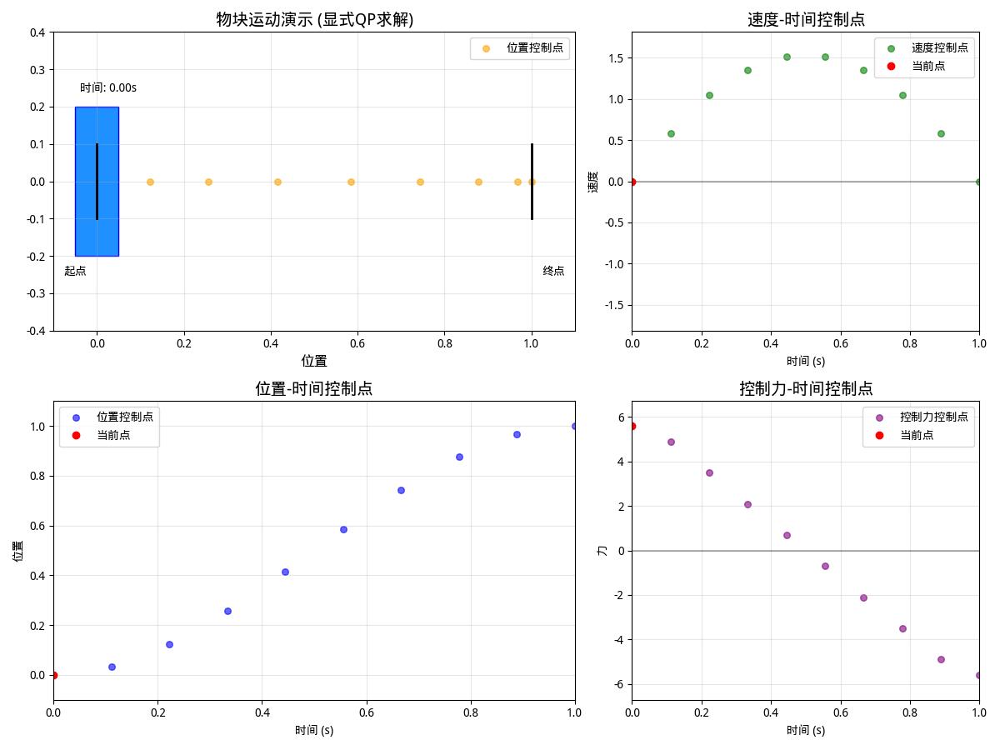
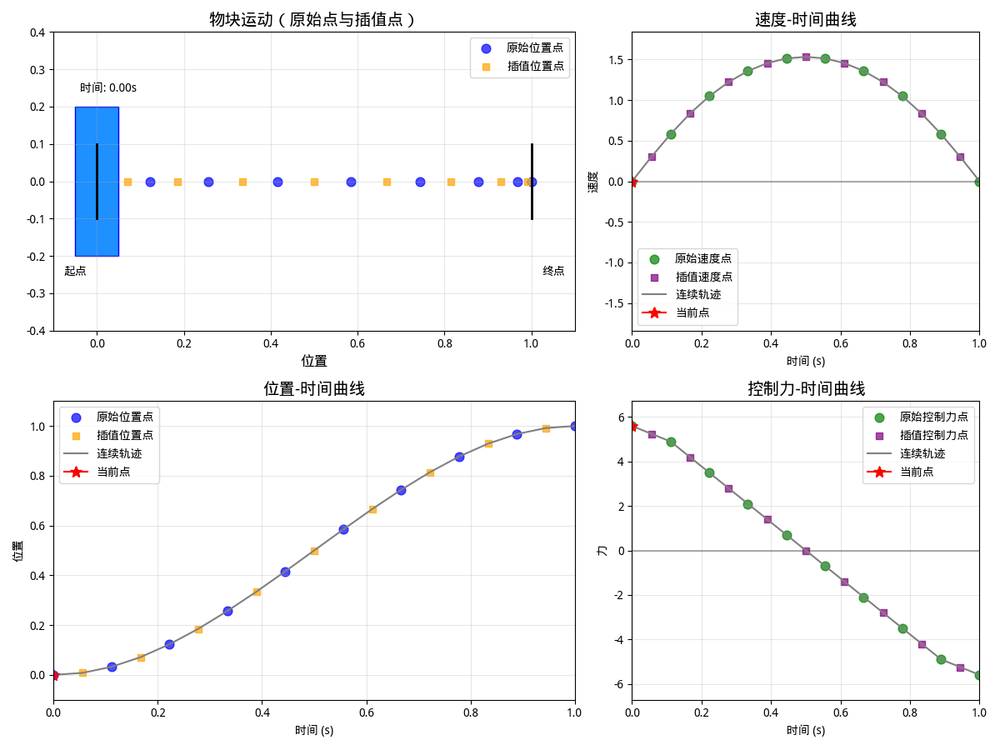

# 梯形配点法

## 系统动力学的离散化

系统动力学（通常为微分方程 $\dot{x} = f(t, x, u)$）是轨迹优化的核心约束。梯形配点法将其转化为**配点约束**，步骤如下：

1. **动力学的积分形式**：对微分方程 $\dot{x} = f(t, x, u)$ 两边在区间 $[t_k, t_{k+1}]$ 上积分，得到：  
   $$x(t_{k+1}) - x(t_k) = \int_{t_k}^{t_{k+1}} f(\tau, x(\tau), u(\tau)) d\tau$$  
   （左边为状态变量的变化量，右边为动力学函数的积分）

2. **积分的梯形近似**：用梯形求积公式近似右边的积分，即：  
   $$\int_{t_k}^{t_{k+1}} f(\tau, x(\tau), u(\tau)) d\tau \approx \frac{1}{2} h_k \cdot (f_k + f_{k+1})$$  
   其中 $f_k = f(t_k, x_k, u_k)$（动力学函数在配点 $t_k$ 处的取值）

3. **配点约束**：结合上述两步，得到离散化的动力学约束（配点约束）：  
   $$x_{k+1} - x_k = \frac{1}{2} h_k \cdot (f_k + f_{k+1}) \quad (k = 0, 1, ..., N-1)$$

## 各类约束的处理

### 状态与控制量的简单界限约束

若问题中存在对状态变量 $x(t)$ 或控制变量 $u(t)$ 的简单界限（如最大值、最小值限制），梯形配点法通过要求这些变量在**所有配点处**满足约束来近似连续条件

- 状态约束示例：  
  连续条件 $x(t) < 0$（对所有 $t \in [t_0, t_F]$ 成立）  
  离散化为：$x_k < 0$ 对所有配点 $k = 0, 1, ..., N$ 成立
- 控制约束示例：  
  连续条件 $u(t) < 0$（对所有 $t \in [t_0, t_F]$ 成立）  
  离散化为：$u_k < 0$ 对所有配点 $k = 0, 1, ..., N$ 成立

### 路径约束

路径约束是指在整个轨迹区间 $[t_0, t_F]$ 内持续生效的约束（如“某状态变量不得超过安全阈值”等），通常表示为 $g(t, x(t), u(t)) < 0$

连续条件 $g(t, x(t), u(t)) < 0$（对所有 $t$ 成立）  
离散化为：$g(t_k, x_k, u_k) < 0$ 对所有配点 $k = 0, 1, ..., N$ 成立

### 边界约束

边界约束仅在轨迹的起点 $t_0$ 或终点 $t_F$ 生效（如“初始状态必须为 $x_0$”“终点速度不得超过某值”等）

通常表示为 $h(t_0, x(t_0), u(t_0)) < 0$ 或 $h(t_F, x(t_F), u(t_F)) < 0$

连续条件 $h(t_0, x(t_0), u(t_0)) < 0$  
离散化为：$h(t_0, x_0, u_0) < 0$

## 插值

### 控制轨迹的插值：线性样条

控制变量 $u(t)$ 的轨迹被近似为**分段线性函数**（一阶样条）其构建方式如下：

- **已知条件**：在每个节点 $t_k$ 和 $t_{k+1}$ 处，控制量的取值为 $u_k = u(t_k)$ 和 $u_{k+1} = u(t_{k+1})$，区间长度为 $h_k = t_{k+1} - t_k$。
- **变量定义**：令 $\tau = t - t_k$（表示在区间 $[t_k, t_{k+1}]$ 内，从起点 $t_k$ 开始的时间偏移，$\tau \in [0, h_k]$）。
- **线性插值公式**：在区间 $[t_k, t_{k+1}]$ 内，控制量 $u(t)$ 的近似表达式为：

  $$
  u(t) \approx u_k + \frac{\tau}{h_k} (u_{k+1} - u_k)
  $$

  这是典型的线性插值：当 $\tau=0$（即 $t=t_k$）时，$u(t)=u_k$；当 $\tau=h_k$（即 $t=t_{k+1}$）时，$u(t)=u_{k+1}$；中间时刻的控制量随时间线性变化。

### 状态轨迹的插值：二次样条

状态变量 $x(t)$ 的轨迹被近似为**分段二次函数**（二阶样条），这一结果直接来自梯形配点法的动力学约束，具体推导如下：

#### **步骤 1：动力学的线性近似**

系统动力学 $\dot{x}(t) = f(t, x(t), u(t))$ 在区间 $[t_k, t_{k+1}]$ 内被近似为**线性函数**。原因是：梯形配点方程在动力学 $f(t)$ 线性变化时是精确的，因此可合理假设：

$$
f(t) \approx f_k + \frac{\tau}{h_k} (f_{k+1} - f_k)
$$

其中 $f_k = f(t_k, x_k, u_k)$，$f_{k+1} = f(t_{k+1}, x_{k+1}, u_{k+1})$，$\tau = t - t_k$

#### **步骤 2：状态轨迹的积分推导**

状态 $x(t)$ 是动力学 $\dot{x}(t) = f(t)$ 的积分，即 $x(t) = \int \dot{x}(t) d\tau + c$（$c$ 为积分常数）。对线性动力学积分，得到：  
$$x(t) \approx \int \left[ f_k + \frac{\tau}{h_k} (f_{k+1} - f_k) \right] d\tau + c = c + f_k \tau + \frac{\tau^2}{2h_k} (f_{k+1} - f_k) \tag{3.9}$$

#### **步骤 3：确定积分常数**

利用区间起点的状态约束（$\tau=0$ 时，$x(t) = x_k$）求解 $c$：  
当 $\tau=0$ 时，$x(t) = x_k = c + 0 + 0 \implies c = x_k$。

代入式（3.9），得到状态轨迹在区间 $[t_k, t_{k+1}]$ 内的二次样条表达式：

$$
x(t) \approx x_k + f_k \tau + \frac{\tau^2}{2h_k} (f_{k+1} - f_k)
$$

## 示例

|  |  |
| ------------------------------------------------------- | -------------------------------------------------------------------- |

左图演示的是 $N=10$ 的情况，仅在控制点进行控制，

右图使用插值方法将 $N=10$ 个控制点和状态点拓展到 $19$ 个
