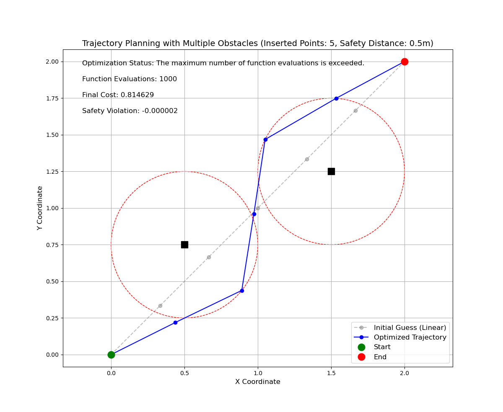
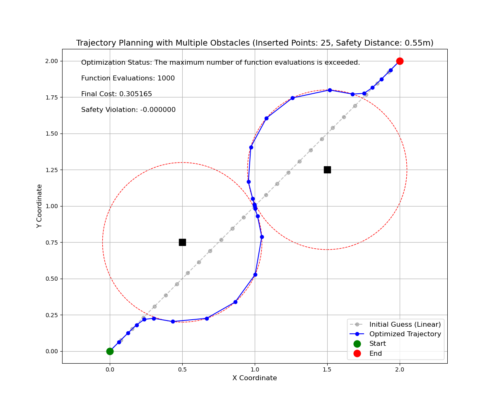
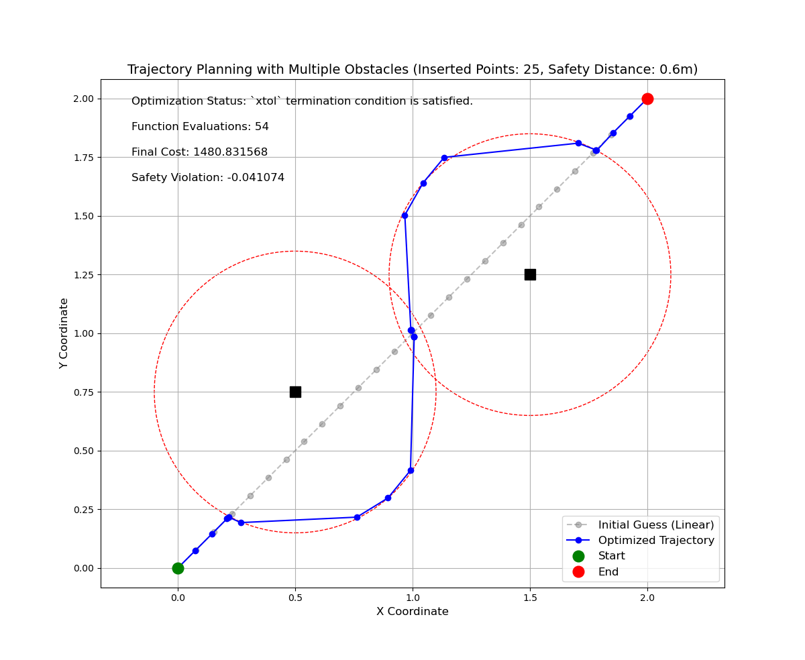

# 问题定义

- 二维空间给定起点和目标点

`Star_Pose = [0, 0]`
`End_Pose = [2, 2]`

- 在`[[0.5, 0.75], [1.5, 1.25]]`处有两个点障碍,

`Obs_Pose=[[0.5, 0.75], [1.5, 1.25]]`

**求解连接起点和目标点且不与障碍发生碰撞的路径点序列**

# 问题描述

## 条件 

需要在起点和目标点之间生成指定`SIZE=n`个路径点

## 约束

- 生成的路径点构成的总长度尽量短
- 生成的路径点障碍物保持安全距离`Safe_Dis = 0.3m`


# 最小二乘格式数学描述

## 变量定义

- 定义路径序列 $\mathbf{X} = \{ \mathbf{x}_i \}_{i=0}^{n+1}$，其中 $\mathbf{x}_i = [x_i, y_i]$ 表示第 $i$ 个路径点的位置，满足以下边界条件：

$$
\mathbf{x}_0 = [0, 0], \quad \mathbf{x}_{n+1} = [2, 2]
$$

- 定义障碍序列$\mathbf{O}=\{\mathbf{o}_j \}_{j=0}^m$，其中 $\mathbf{o}_j = [x_j, y_j]$ 表示第 $j$ 个障碍点的位置

## 最小二乘目标函数

最小化以下目标函数：

$$
\min \bigg\{ \sum_{i=1}^{n+1} \big[(x_i - x_{i-1})^2 + (y_i - y_{i-1})^2\big] + \lambda \sum_{i=0}^{n+1} \max\big(0, Safe\_Dis - d_{i}\big)^2 \bigg\}
$$

其中：
- $d_{i} = min_{j=0}^m \big\{ \sqrt{(x_i - x_j)^2 + (y_i - y_j)^2}\big\}$ 是轨迹点 $\mathbf{x}_i$ 到障碍序列$\mathbf{O}$ 的最近距离
- $\lambda > 0$ 是平衡路径长度和安全距离的权重系数

## 待求解变量

$\mathbf{X} = \{ \mathbf{x}_i \}_{i=1}^{n}$

## 约束条件

1. **边界条件**：

$$
   \mathbf{x}_0 = [0, 0], \quad \mathbf{x}_{n+1} = [2, 2]
$$

3. **安全距离约束**（已包含在目标函数中）：

 $$
d_{i} = min_{j=0}^m \big\{ \sqrt{(x_i - x_j)^2 + (y_i - y_j)^2}\big\} 
$$

# `code`

## 定义问题参数

```python
"""
问题参数
    起点位置, 目标点位置, 障碍序列, 安全距离, 代插入路径点数量
"""
start_pose = np.array([0, 0])
end_pose = np.array([2, 2])
obs_pose = np.array([[0.5, 0.75], [1.5, 1.25]])
safe_dis = 0.3  
size = 25  
```

## 构造目标函数

使用`scipy`的`least_squares`

```python
from scipy.optimize import least_squares
```

`least_squares`对目标函数要求为
1. **优化器的输入要求**
  要求输入参数是一维数组（向量）。这是因为优化器内部使用的数学运算（如梯度计算、迭代更新）通常基于向量形式实现
2. **返回残差向量**
  目标函数必须返回一个一维数组（残差向量），而不是标量值。优化器会最小化这个残差向量的平方和（即最小二乘问题的目标）：
3. **参数顺序**
  目标函数的第一个参数必须是待优化的变量（即需要调整以最小化残差的参数）。其他参数（如权重）可以通过 args 参数传入：

所以目标函数输入设置为 $\mathbf{X} = \{ \mathbf{x}_i \}_{i=1}^{n}$ 一维降维格式, 
此外目标函数中的 $\lambda > 0$ 也可以作为其他参数传入,
最终函数返回一维残差向量

```python
def objective_function(params, lambda_weight=100):
    """构建最小二乘问题的目标函数"""
    # 重塑参数为轨迹点(一维->二维)
    trajectory = params.reshape(-1, 2)
    
    # 构建完整轨迹（包括起点和终点）
    full_trajectory = np.vstack((start_pose, trajectory, end_pose))
    
    # 1. 路径长度项（相邻点之间的欧氏距离）
    path_length_terms = []
    for i in range(1, len(full_trajectory)):
        dx = full_trajectory[i, 0] - full_trajectory[i-1, 0]
        dy = full_trajectory[i, 1] - full_trajectory[i-1, 1]
        path_length_terms.append(np.sqrt(dx**2 + dy**2))
    
    # 2. 安全距离约束项（对每个障碍物都计算）
    safety_terms = []
    for point in full_trajectory:
        # 计算到每个障碍物的距离，取最小距离（最危险的障碍物）
        min_dist_to_obs = min(np.linalg.norm(point - obs) for obs in obs_pose)
        # 当最小距离小于安全距离时施加惩罚
        safety_violation = max(0, safe_dis - min_dist_to_obs)
        safety_terms.append(safety_violation)
    
    # 3. 组合所有项
    residuals = []
    residuals.extend(path_length_terms)  # 路径长度项
    residuals.extend([lambda_weight * s for s in safety_terms])  # 安全约束项（带权重）
    
    return np.array(residuals)
```

### 生成初始路径

为了提高优化成功率, 初始化一条起点连接目标点的线性路径序列

```python
# 生成线性插值的初始猜测
def generate_linear_initial_guess():
    """生成线性插值的初始猜测"""
    initial_guess = np.zeros((size, 2))
    for i in range(size):
        ratio = (i + 1) / (size + 1)
        point = start_pose + ratio * (end_pose - start_pose)
        initial_guess[i] = point
    return initial_guess
```

## 求解


```python
if __name__ == '__main__':
    # 生成初始猜测（线性插值）
    initial_guess = generate_linear_initial_guess()
    initial_guess_flat = initial_guess.flatten()

    result = least_squares(
        objective_function,
        initial_guess_flat,
        method='trf',
        args=(500,),
        verbose=1,
        ftol=1e-8,
        xtol=1e-8,
        max_nfev=1000,
        bounds=(-10, 10)
        )
```

| 参数               | 作用                                                                 | 示例/默认值                          | 调整建议                                                                 |
|--------------------|----------------------------------------------------------------------|---------------------------------------|--------------------------------------------------------------------------|
| `objective_function` | 目标函数，返回残差向量（一维数组），优化器最小化残差的平方和          | `def objective(params, ...): ...`     | 确保残差向量合理反映路径长度和约束违反程度                              |
| `initial_guess_flat` | 优化变量的初始猜测值（一维数组），算法从该点开始搜索                   | `initial_guess.flatten()`             | 初始值影响收敛速度和结果质量，可尝试不同初始化策略                      |
| `method='trf'`     | 优化算法类型，`'trf'` 支持边界约束，适用于大规模非线性问题               | `'trf'`（默认）、`'dogbox'`、`'lm'`   | 带约束问题首选 `'trf'`，无约束问题可用 `'lm'`                            |
| `args=(500,)`      | 传递给目标函数的额外参数（元组形式），如安全约束权重                     | `(lambda_weight,)`                    | 增大权重强化安全约束，减小权重优先缩短路径                              |
| `verbose=1`        | 控制优化过程的输出详细程度                                              | `0`（无输出）、`1`（迭代信息）、`2`（详细过程） | 调试时用 `2`，生产环境用 `0` 或 `1`                                      |
| `ftol=1e-8`        | 函数收敛容差，残差向量的相对变化小于此值时停止迭代                      | `1e-8`                                | 若优化过早停止，减小容差；若耗时过长，增大容差                          |
| `xtol=1e-8`        | 变量收敛容差，优化变量的相对变化小于此值时停止迭代                      | `1e-8`                                | 同上                                                                     |
| `max_nfev=1000`    | 最大函数评估次数，防止算法无限循环                                        | `1000`                                | 复杂问题可增加此值（如 `2000`）                                          |
| `bounds=(-10, 10)` | 优化变量的边界约束，确保参数值在合理范围内                                | `(-10, 10)`                           | 根据问题规模调整，确保覆盖所有可能的轨迹点位置                          |

## 结果

|   |  | 
| --- | --- | 
|`SIZE=5`,`Safe_Dis = 0.3m`|`SIZE=25`,`Safe_Dis = 0.3m`|
|  |   | 
|`SIZE=25`,`Safe_Dis = 0.55m`|`SIZE=25`,`Safe_Dis = 0.6m`|
- 插入点过少时，生成路径不连贯
- 安全距离过大时，导致障碍附近路径点分布稀疏

### 一些修改建议☝️

- 添加相邻路径点距离约束，对于相邻路径点过远情况施加约束，保证路径点分布的均匀性

### `cost`计算细节🤌

在问题中，`result.cost` 是最小二乘优化的目标函数值（残差平方和的一半），其最小值取决于 **路径长度** 和 **安全约束惩罚** 的平衡，没有固定的理论最小值。以下是具体分析：


###  `result.cost` 的计算公式
`result.cost` 由 `scipy.optimize.least_squares` 自动计算，等于残差向量平方和的一半：

$$
\text{result.cost} = 0.5 \times \sum_{i=1}^{m} r_i^2
$$

其中 \( r_i \) 是目标函数返回的残差向量元素（包含路径长度项和安全约束项）。

例如，当 size=25 时，直线被分为 26 段，每段距离约 2.828/26≈0.109，则：

$$
cost_{min}​≈0.5×26×(0.109)^2≈0.5×26×0.0119≈0.155
$$

# 附录

## 完整代码

<details> <summary>完整代码</summary>
<pre><code> 
import numpy as np
import matplotlib.pyplot as plt
from scipy.optimize import least_squares
import time  

"""
问题参数
    起点位置, 目标点位置, 障碍序列, 安全距离, 代插入路径点数量
"""
start_pose = np.array([0, 0])
end_pose = np.array([2, 2])
obs_pose = np.array([[0.5, 0.75], [1.5, 1.25]])
safe_dis = 0.5
size = 25  


def compute_safety_violation(trajectory):
    """计算路径点到所有障碍的最小距离，评估安全约束违反程度"""
    min_dist = float('inf')
    for point in trajectory:
        # 计算到每个障碍物的距离，取最小值
        dist_to_obs = min(np.linalg.norm(point - obs) for obs in obs_pose)
        if dist_to_obs < min_dist:
            min_dist = dist_to_obs
    return min_dist - safe_dis  # 小于0表示存在安全约束违反

def objective_function(params, lambda_weight=100):
    """构建最小二乘问题的目标函数"""
    # 重塑参数为轨迹点(一维->二维)
    trajectory = params.reshape(-1, 2)
    
    # 构建完整轨迹（包括起点和终点）
    full_trajectory = np.vstack((start_pose, trajectory, end_pose))
    
    # 1. 路径长度项（相邻点之间的欧氏距离）
    path_length_terms = []
    for i in range(1, len(full_trajectory)):
        dx = full_trajectory[i, 0] - full_trajectory[i-1, 0]
        dy = full_trajectory[i, 1] - full_trajectory[i-1, 1]
        path_length_terms.append(np.sqrt(dx**2 + dy**2))
    
    # 2. 安全距离约束项（对每个障碍物都计算）
    safety_terms = []
    for point in full_trajectory:
        # 计算到每个障碍物的距离，取最小距离（最危险的障碍物）
        min_dist_to_obs = min(np.linalg.norm(point - obs) for obs in obs_pose)
        # 当最小距离小于安全距离时施加惩罚
        safety_violation = max(0, safe_dis - min_dist_to_obs)
        safety_terms.append(safety_violation)
    
    # 3. 组合所有项
    residuals = []
    residuals.extend(path_length_terms)  # 路径长度项
    residuals.extend([lambda_weight * s for s in safety_terms])  # 安全约束项（带权重）
    
    return np.array(residuals)

def visualize_trajectory(result, initial_guess):
    """可视化轨迹规划结果（支持多个障碍物）"""
    # 提取优化后的轨迹点
    trajectory = result.x.reshape(-1, 2)
    full_trajectory = np.vstack((start_pose, trajectory, end_pose))
    
    # 提取初始猜测轨迹
    initial_trajectory = initial_guess.reshape(-1, 2)
    initial_full = np.vstack((start_pose, initial_trajectory, end_pose))
    
    # 创建图形
    plt.figure(figsize=(12, 10))
    
    # 绘制初始猜测轨迹（灰色虚线）
    plt.plot(initial_full[:, 0], initial_full[:, 1], 'o--', color='gray', alpha=0.5, label='Initial Guess (Linear)')
    
    # 绘制优化后的轨迹
    plt.plot(full_trajectory[:, 0], full_trajectory[:, 1], 'o-', color='blue', label='Optimized Trajectory')
    
    # 绘制起点和终点
    plt.plot(start_pose[0], start_pose[1], 'go', markersize=12, label='Start')
    plt.plot(end_pose[0], end_pose[1], 'ro', markersize=12, label='End')
    
    # 绘制所有障碍物及其安全区域
    for obs in obs_pose:
        # 安全区域（虚线圆）
        circle = plt.Circle(obs, safe_dis, color='r', fill=False, linestyle='--')
        plt.gca().add_patch(circle)
        # 障碍物本身（黑色方块）
        plt.plot(obs[0], obs[1], 'ks', markersize=12, label='Obstacle' if obs is obs_pose[0] else "")
    
    # 添加标签和图例
    plt.grid(True)
    plt.axis('equal')
    plt.xlabel('X Coordinate', fontsize=12)
    plt.ylabel('Y Coordinate', fontsize=12)
    plt.title(f'Trajectory Planning with Multiple Obstacles (Inserted Points: {size}, Safety Distance: {safe_dis}m)', fontsize=14)
    plt.legend(fontsize=12)
    
    # 显示优化结果
    safety_violation = compute_safety_violation(full_trajectory)
    plt.text(0.05, 0.95, f'Optimization Status: {result.message}', transform=plt.gca().transAxes, fontsize=12)
    plt.text(0.05, 0.90, f'Function Evaluations: {result.nfev}', transform=plt.gca().transAxes, fontsize=12)
    plt.text(0.05, 0.85, f'Final Cost: {result.cost:.6f}', transform=plt.gca().transAxes, fontsize=12)
    plt.text(0.05, 0.80, f'Safety Violation: {safety_violation:.6f}', transform=plt.gca().transAxes, fontsize=12)
    
    plt.show()

# 生成线性插值的初始猜测
def generate_linear_initial_guess():
    """生成线性插值的初始猜测"""
    initial_guess = np.zeros((size, 2))
    for i in range(size):
        ratio = (i + 1) / (size + 1)
        point = start_pose + ratio * (end_pose - start_pose)
        initial_guess[i] = point
    return initial_guess

if __name__ == '__main__':

    # 生成初始猜测（线性插值）
    initial_guess = generate_linear_initial_guess()
    initial_guess_flat = initial_guess.flatten()

    # 记录优化开始时间
    start_time = time.time()
    # 执行优化
    result = least_squares(
        objective_function,
        initial_guess_flat,
        method='trf',
        args=(500,),
        verbose=1,
        ftol=1e-8,
        xtol=1e-8,
        max_nfev=1000,
        bounds=(-10, 10)
    )
    # 计算优化耗时
    optimization_time = time.time() - start_time

    trajectory = result.x.reshape(-1, 2)
    full_trajectory = np.vstack((start_pose, trajectory, end_pose))
    safety_violation = compute_safety_violation(full_trajectory)
        
    print(f"Safety Violation: {safety_violation:.6f}")
    print(f"Optimization Time: {optimization_time:.4f} seconds")
        
    if result is not None:
        print("\nFinal Optimization Result:")
        print("Status:", result.message)
        print("Iterations:", result.nfev)
        print("Objective Function Value:", result.cost)
        visualize_trajectory(result, initial_guess)
    else:
        print("Optimization failed, no feasible solution found")
</code></pre>
</details>
