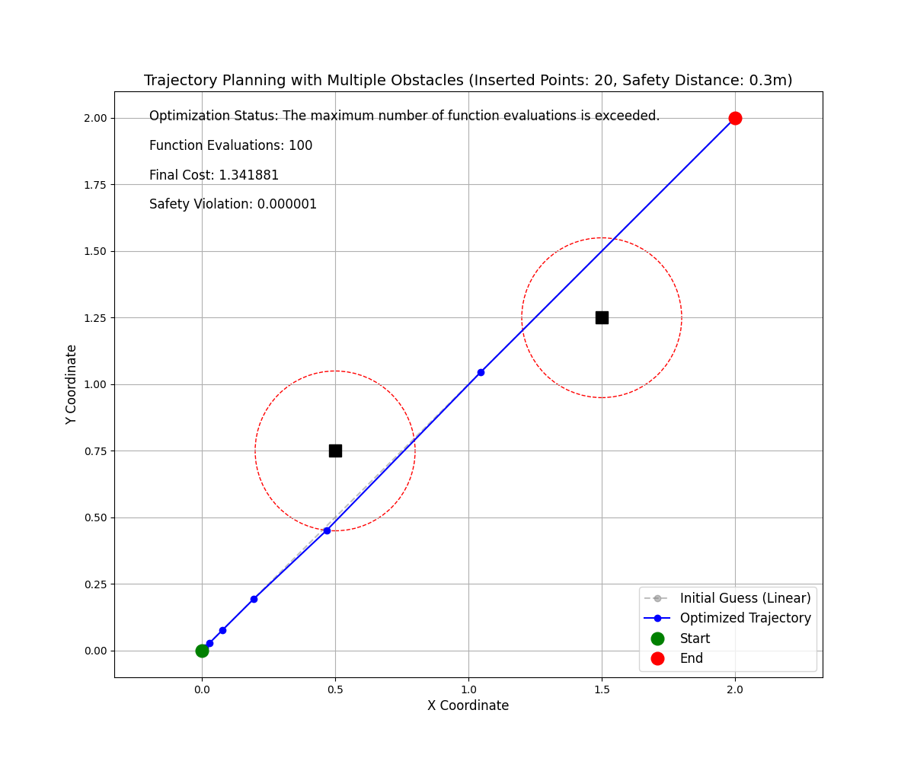
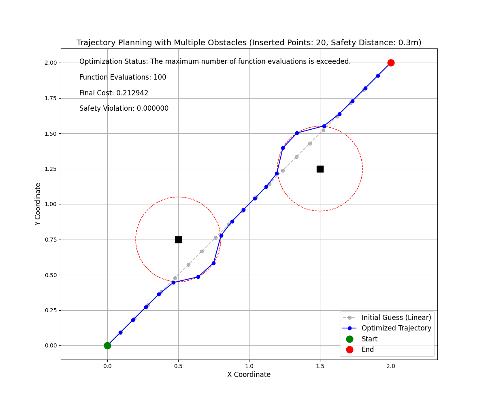
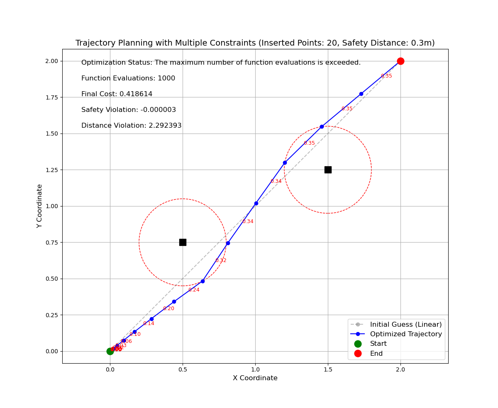
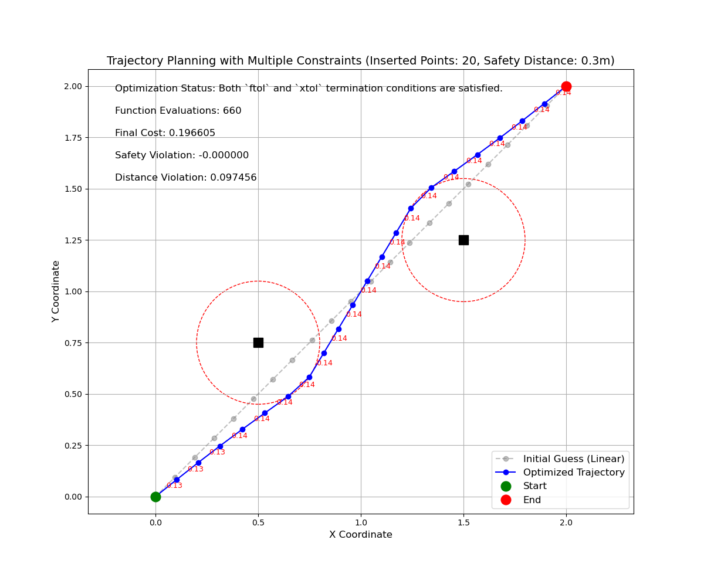

# 最小化目标函数思考

在[1.最小二乘路径求解A.md](1.最小二乘路径求解A.md)中我们选择在起始点均匀插入`SIZE`个路径点作为初始值

由于初始路径序列经过障碍区域，所以该序列本身并不是较优秀的结果

那思考下，基于目标函数，可能的最优路径序列是什么？

$$
\min \bigg\{ \sum_{i=1}^{n+1} \big[(x_i - x_{i-1})^2 + (y_i - y_{i-1})^2\big] + \lambda \sum_{i=0}^{n+1} \max\big(0, Safe\_Dis - d_{i}\big)^2 \bigg\}
$$

- 首先路径长度一定会产生`cost`，最小值即为起点连接目标点的长度
- 其次只要路径点在障碍区域外，障碍便不会产生`cost`

所以最优状态有以下两个特点

- 路径点在起点和目标点连接的线段上
- 路径点不在障碍范围内

所有，我把`SIZE`个点均放在起点或者终点，这样是不是最优呢？

修改上一节代码

```python

# other code
start_pose = np.array([0, 0])
end_pose = np.array([2, 2])
obs_pose = np.array([[0.5, 0.75], [1.5, 1.25]])
safe_dis = 0.3
size = 20  

# other code

# 生成线性插值的初始猜测
def generate_linear_initial_guess():
    """生成线性插值的初始猜测"""
    initial_guess = np.zeros((size, 2))
    # for i in range(size):
    #     ratio = (i + 1) / (size + 1)
    #     point = start_pose + ratio * (end_pose - start_pose)
    #     initial_guess[i] = point
    return initial_guess
```

所有初始路径点均在$[0,0]$点，计算结果如下

|||
|:--:|:--:|
|初始路径全位于起点|线性插值初始路径点|

基本验证了猜想，也暴露了上一节中目标函数设计问题-<font color='red'>没有考虑相邻路径点之间的约束</font>

# 新增约束

假设起始点的直线距离为`l`,中间插入`SIZE`个轨迹点，理论上均匀分布的两个相邻路径点之间的距离最小为

$$
l_{min}=\frac{l}{SIZE}
$$

对于最大距离，我们希望最后路径总长度要小于$1.5d$,所以最大距离为

$$
l_{max}=\frac{1.5l}{SIZE}
$$

对于超出$[l_{min},l_{max}]$的`l`产生代价(取$l_{mid}=\frac{l_{max}-l_{min}}{2}$)，修改目标函数为

$$
\begin{align}
\min \bigg\{ 
&\sum_{i=1}^{n+1} \big[(x_i - x_{i-1})^2 + (y_i - y_{i-1})^2\big] + \\
&\lambda_1 \sum_{i=0}^{n+1} \max \big(0, Safe\_Dis - d_{i}\big)^2 +\\
&\lambda_2 \sum_{i=0}^{n} (l_{mid} - l_i)^2
\bigg\}
\end{align}
$$

## 结果

完整代码[2_path_solveB](code/2_path_solveB.py)

|||
|:--:|:--:|
|初始路径全位于起点|线性插值初始路径点|

二者除了初始路径序列不同，其他条件一致，可以看到路径的均匀性有改善。

