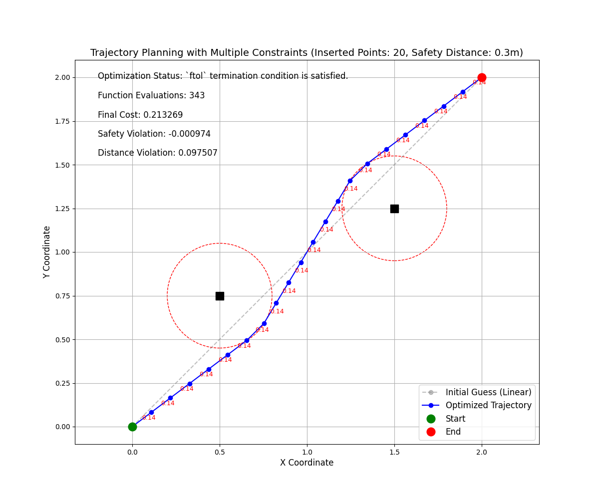

# 最小化目标函数思考

在[1.最小二乘路径求解A.md](1.最小二乘路径求解A.md)中我们选择在起始点均匀插入`SIZE`个路径点作为初始值

由于初始路径序列经过障碍区域，所以该序列本身并不是较优秀的结果

那思考下，基于目标函数，可能的最优路径序列是什么？

$$
\min \bigg\{ \sum_{i=1}^{n+1} \big[(x_i - x_{i-1})^2 + (y_i - y_{i-1})^2\big] + \lambda \sum_{i=0}^{n+1} \max\big(0, Safe\_Dis - d_{i}\big)^2 \bigg\}
$$

- 首先路径长度一定会产生`cost`，最小值即为起点连接目标点的长度
- 其次只要路径点在障碍区域外，障碍便不会产生`cost`

所以最优状态有以下两个特点

- 路径点在起点和目标点连接的线段上
- 路径点不在障碍范围内

所有，我把`SIZE`个点均放在起点或者终点，这样是不是最优呢？

修改上一节代码

```python

# other code
start_pose = np.array([0, 0])
end_pose = np.array([2, 2])
obs_pose = np.array([[0.5, 0.75], [1.5, 1.25]])
safe_dis = 0.3
size = 20  

# other code

# 生成线性插值的初始猜测
def generate_linear_initial_guess():
    """生成线性插值的初始猜测"""
    initial_guess = np.zeros((size, 2))
    # for i in range(size):
    #     ratio = (i + 1) / (size + 1)
    #     point = start_pose + ratio * (end_pose - start_pose)
    #     initial_guess[i] = point
    return initial_guess
```

所有初始路径点均在$[0,0]$点，计算结果如下

|||
|:--:|:--:|
|初始路径全位于起点|线性插值初始路径点|

基本验证了猜想，也暴露了上一节中目标函数设计问题-<font color='red'>没有考虑相邻路径点之间的约束</font>

# 新增约束

假设起始点的直线距离为`l`,中间插入`SIZE`个轨迹点，理论上均匀分布的两个相邻路径点之间的距离最小为

$$
l_{min}=\frac{l}{SIZE}
$$

对于最大距离，我们希望最后路径总长度要小于$1.5d$,所以最大距离为

$$
l_{max}=\frac{1.5l}{SIZE}
$$

对于超出$[l_{min},l_{max}]$的`l`产生代价，修改目标函数为

$$
\begin{align}
\min \bigg\{ 
&\sum_{i=1}^{n+1} \big[(x_i - x_{i-1})^2 + (y_i - y_{i-1})^2\big] + \\
&\lambda_1 \sum_{i=0}^{n+1} \max\big(0, Safe\_Dis - d_{i}\big)^2 +\\
&\lambda_2 \sum_{i=0}^{n}\big[max\big(0, l_{min} - l_{i}\big)+min\big(0, l_{i}-l_{max} \big)\big]^2
\bigg\}
\end{align}
$$

## 结果

完整代码见附录

|||
|:--:|:--:|
|初始路径全位于起点|线性插值初始路径点|

二者除了初始路径序列不同，其他条件一致，可以看到路径的均匀性有改善。

# 附录

## 代码1

<details> <summary>完整代码</summary>
<pre><code> 
import numpy as np
import matplotlib.pyplot as plt
from scipy.optimize import least_squares
import time

"""
问题参数
    起点位置, 目标点位置, 障碍序列, 安全距离, 插入路径点数量
"""
start_pose = np.array([0, 0])
end_pose = np.array([2, 2])
obs_pose = np.array([[0.5, 0.75], [1.5, 1.25]])
safe_dis = 0.3
size = 20

def compute_safety_violation(trajectory):
    """计算路径点到所有障碍的最小距离，评估安全约束违反程度"""
    min_dist = float('inf')
    for point in trajectory:
        # 计算到每个障碍物的距离，取最小值
        dist_to_obs = min(np.linalg.norm(point - obs) for obs in obs_pose)
        if dist_to_obs < min_dist:
            min_dist = dist_to_obs
    return min_dist - safe_dis  # 小于0表示存在安全约束违反

def objective_function(params, lambda_weight=100, lambda_dist=100):
    """构建最小二乘问题的目标函数，现在包含相邻路径点距离约束"""
    # 重塑参数为轨迹点(一维->二维)
    trajectory = params.reshape(-1, 2)
    
    # 构建完整轨迹（包括起点和终点）
    full_trajectory = np.vstack((start_pose, trajectory, end_pose))
    
    # 直线距离（用于计算l_min和l_max）
    total_distance = np.linalg.norm(end_pose - start_pose)
    l_min = total_distance / size
    l_max = 1.5 * total_distance / size
    
    # 1. 路径长度项（相邻点之间的欧氏距离）
    path_length_terms = []
    for i in range(1, len(full_trajectory)):
        dx = full_trajectory[i, 0] - full_trajectory[i-1, 0]
        dy = full_trajectory[i, 1] - full_trajectory[i-1, 1]
        segment_distance = np.sqrt(dx**2 + dy**2)
        path_length_terms.append(segment_distance)
    
    # 2. 安全距离约束项（对每个障碍物都计算）
    safety_terms = []
    for point in full_trajectory:
        # 计算到每个障碍物的距离，取最小距离（最危险的障碍物）
        min_dist_to_obs = min(np.linalg.norm(point - obs) for obs in obs_pose)
        # 当最小距离小于安全距离时施加惩罚
        safety_violation = max(0, safe_dis - min_dist_to_obs)
        safety_terms.append(safety_violation)
    
    # 3. 相邻路径点距离约束项
    distance_constraint_terms = []
    for i in range(1, len(full_trajectory)):
        dx = full_trajectory[i, 0] - full_trajectory[i-1, 0]
        dy = full_trajectory[i, 1] - full_trajectory[i-1, 1]
        segment_distance = np.sqrt(dx**2 + dy**2)
        
        # 计算约束违反程度
        below_min = max(0, l_min - segment_distance)
        above_max = max(0, segment_distance - l_max)
        
        # 添加约束项
        distance_constraint_terms.append(below_min + above_max)
    
    # 4. 组合所有项
    residuals = []
    residuals.extend(path_length_terms)  # 路径长度项
    residuals.extend([lambda_weight * s for s in safety_terms])  # 安全约束项（带权重）
    residuals.extend([lambda_dist * d for d in distance_constraint_terms])  # 相邻距离约束项（带权重）
    
    return np.array(residuals)

def visualize_trajectory(result, initial_guess):
    """可视化轨迹规划结果（支持多个障碍物）"""
    # 提取优化后的轨迹点
    trajectory = result.x.reshape(-1, 2)
    full_trajectory = np.vstack((start_pose, trajectory, end_pose))
    
    # 提取初始猜测轨迹
    initial_trajectory = initial_guess.reshape(-1, 2)
    initial_full = np.vstack((start_pose, initial_trajectory, end_pose))
    
    # 创建图形
    plt.figure(figsize=(12, 10))
    
    # 绘制初始猜测轨迹（灰色虚线）
    plt.plot(initial_full[:, 0], initial_full[:, 1], 'o--', color='gray', alpha=0.5, label='Initial Guess (Linear)')
    
    # 绘制优化后的轨迹
    plt.plot(full_trajectory[:, 0], full_trajectory[:, 1], 'o-', color='blue', label='Optimized Trajectory')
    
    # 绘制相邻路径点距离
    for i in range(1, len(full_trajectory)):
        midpoint_x = (full_trajectory[i-1, 0] + full_trajectory[i, 0]) / 2
        midpoint_y = (full_trajectory[i-1, 1] + full_trajectory[i, 1]) / 2
        segment_distance = np.linalg.norm(full_trajectory[i] - full_trajectory[i-1])
        plt.text(midpoint_x, midpoint_y, f'{segment_distance:.2f}', fontsize=9, color='red')
    
    # 绘制起点和终点
    plt.plot(start_pose[0], start_pose[1], 'go', markersize=12, label='Start')
    plt.plot(end_pose[0], end_pose[1], 'ro', markersize=12, label='End')
    
    # 绘制所有障碍物及其安全区域
    for obs in obs_pose:
        # 安全区域（虚线圆）
        circle = plt.Circle(obs, safe_dis, color='r', fill=False, linestyle='--')
        plt.gca().add_patch(circle)
        # 障碍物本身（黑色方块）
        plt.plot(obs[0], obs[1], 'ks', markersize=12, label='Obstacle' if obs is obs_pose[0] else "")
    
    # 添加标签和图例
    plt.grid(True)
    plt.axis('equal')
    plt.xlabel('X Coordinate', fontsize=12)
    plt.ylabel('Y Coordinate', fontsize=12)
    plt.title(f'Trajectory Planning with Multiple Constraints (Inserted Points: {size}, Safety Distance: {safe_dis}m)', fontsize=14)
    plt.legend(fontsize=12)
    
    # 显示优化结果
    safety_violation = compute_safety_violation(full_trajectory)
    
    # 计算相邻路径点距离约束的违反程度
    distance_violation = 0
    total_distance = np.linalg.norm(end_pose - start_pose)
    l_min = total_distance / size
    l_max = 1.5 * total_distance / size
    
    for i in range(1, len(full_trajectory)):
        segment_distance = np.linalg.norm(full_trajectory[i] - full_trajectory[i-1])
        below_min = max(0, l_min - segment_distance)
        above_max = max(0, segment_distance - l_max)
        distance_violation += below_min + above_max
    
    plt.text(0.05, 0.95, f'Optimization Status: {result.message}', transform=plt.gca().transAxes, fontsize=12)
    plt.text(0.05, 0.90, f'Function Evaluations: {result.nfev}', transform=plt.gca().transAxes, fontsize=12)
    plt.text(0.05, 0.85, f'Final Cost: {result.cost:.6f}', transform=plt.gca().transAxes, fontsize=12)
    plt.text(0.05, 0.80, f'Safety Violation: {safety_violation:.6f}', transform=plt.gca().transAxes, fontsize=12)
    plt.text(0.05, 0.75, f'Distance Violation: {distance_violation:.6f}', transform=plt.gca().transAxes, fontsize=12)
    
    plt.show()

def generate_linear_initial_guess():
    """生成线性插值的初始猜测"""
    initial_guess = np.zeros((size, 2))
    # for i in range(size):
    #     ratio = (i + 1) / (size + 1)
    #     point = start_pose + ratio * (end_pose - start_pose)
    #     initial_guess[i] = point
    return initial_guess

if __name__ == '__main__':
    # 生成初始猜测（线性插值）
    initial_guess = generate_linear_initial_guess()
    initial_guess_flat = initial_guess.flatten()

    # 记录优化开始时间
    start_time = time.time()
    # 执行优化
    result = least_squares(
        objective_function,
        initial_guess_flat,
        method='trf',
        args=(500, 10),  # 分别对应lambda_weight和lambda_dist
        verbose=1,
        ftol=1e-8,
        xtol=1e-8,
        max_nfev=1000,
        bounds=(-10, 10)
    )
    # 计算优化耗时
    optimization_time = time.time() - start_time

    trajectory = result.x.reshape(-1, 2)
    full_trajectory = np.vstack((start_pose, trajectory, end_pose))
    safety_violation = compute_safety_violation(full_trajectory)
    
    print(f"Safety Violation: {safety_violation:.6f}")
    print(f"Optimization Time: {optimization_time:.4f} seconds")
    
    if result is not None:
        print("\nFinal Optimization Result:")
        print("Status:", result.message)
        print("Iterations:", result.nfev)
        print("Objective Function Value:", result.cost)
        visualize_trajectory(result, initial_guess)
    else:
        print("Optimization failed, no feasible solution found")
</code></pre>
</details>

## 代码2

<details> <summary>完整代码</summary>
<pre><code> 
import cvxpy as cp
import numpy as np
import matplotlib.pyplot as plt
import time

def generate_safety_constraints(obstacles, safe_dis, n_planes=8):
    """
    为障碍物生成多边形安全约束
    obstacles: 障碍物中心列表为(x,y)元组
    safe_dis: 最小安全距离
    n_planes: 多边形近似的边数
    """
    constraints = []  # 初始化约束条件列表
    for obs in obstacles:  # 遍历每个障碍物
        angles = np.linspace(0, 2 * np.pi, n_planes, endpoint=False)  # 生成从0到2π的n_planes个等间距角度
        directions = np.vstack([np.cos(angles), np.sin(angles)]).T  # 计算每个角度对应的方向向量
        for d in directions:  # 遍历每个方向向量
            # 计算约束条件：d·x ≤ (d·obs) - safe_dis
            constraints.append({
                'A': d,  # 方向向量作为约束的法向量
                'b': np.dot(d, obs) - safe_dis  # 约束的偏移量
            })
    return constraints  # 返回所有约束条件

def generate_initial_guess(start, end, n_points):
    """在起点和终点之间生成一系列均匀分布的点，作为优化问题的初始猜测值"""
    initial_points = []
    for i in range(1, n_points + 1):
        t = i / (n_points + 1)
        x = start[0] + t * (end[0] - start[0])
        y = start[1] + t * (end[1] - start[1])
        initial_points.extend([x, y])
    return np.array(initial_points)

def optimize_avoidance_path(start, end, obstacles, safe_dis=0.3, n_points=5, boundary=[0, 2]):
    """
    主函数，用于障碍物避碰路径规划
    start: 起始坐标 (x,y)
    end: 终止坐标 (x,y)
    obstacles: 障碍物列表
    safe_dis: 安全距离
    n_points: 路径中间点数量
    boundary: 边界范围 [min, max]
    """
    # 生成安全约束条件
    safe_constraints = generate_safety_constraints(obstacles, safe_dis)
    
    # 定义优化变量(一维数量)
    X = cp.Variable(2 * n_points)
    
    # 生成初始猜测值（用于可视化）
    initial_guess = generate_initial_guess(start, end, n_points)
    
    # 构建路径点序列（包括起始点、中间点和终点）
    path_points = [np.array(start)]
    for i in range(n_points):
        path_points.append(X[2*i:2*i+2])
    path_points.append(np.array(end))
    
    # 定义目标函数：最小化路径总长度
    length_cost = 0
    for i in range(1, len(path_points)):
        diff = path_points[i] - path_points[i-1]  # 计算相邻路径点之间的坐标差
        length_cost += cp.sum_squares(diff)       # 累加坐标差的平方和（近似路径长度）
    
    # 约束条件列表
    constraints = []
    slack_vars = []  # 松弛变量列表
    
    # 安全距离约束（带松弛变量）
    for sc in safe_constraints:
        for i in range(1, len(path_points)-1):
            slack = cp.Variable()  # 定义松弛变量
            # 路径点必须满足安全约束，允许一定范围内的违反（通过松弛变量）
            constraints.append(sc['A'] @ path_points[i] >= sc['b'] - slack)
            constraints.append(slack >= 0)  # 松弛变量必须非负
            slack_vars.append(slack)
    
    # 边界约束
    min_bound, max_bound = boundary
    constraints.extend([
        X >= min_bound - 0.5,  # 路径点的 x 和 y 坐标下限
        X <= max_bound + 0.5   # 路径点的 x 和 y 坐标上限
    ])
    
    # 添加松弛变量的惩罚项到目标函数
    penalty = 100 * cp.sum(cp.hstack(slack_vars))
    total_cost = length_cost + penalty
    
    # 定义并求解优化问题
    problem = cp.Problem(cp.Minimize(total_cost), constraints)
    solve_start = time.time()  # 记录求解开始时间
    try:
        problem.solve(solver=cp.ECOS)  # 使用 ECOS 求解器
    except Exception as e:
        print(f"求解器错误: {e}")
        return None, None, "求解器错误", 0
    solve_end = time.time()  # 记录求解结束时间
    solve_time = solve_end - solve_start  # 计算求解时间
    
    # 检查求解状态
    if problem.status in [cp.OPTIMAL, cp.OPTIMAL_INACCURATE]:
        optimized_points = [np.array(start)]  # 优化后的路径点列表
        for i in range(n_points):
            if X[2*i].value is None or X[2*i+1].value is None:  # 检查优化变量是否有解
                return initial_guess, None, "不可行", solve_time
            optimized_points.append([X[2*i].value, X[2*i+1].value])
        optimized_points.append(np.array(end))
        # 返回初始猜测值、优化后的路径点、求解状态和求解时间
        return initial_guess, np.array(optimized_points), problem.status, solve_time
    else:
        # 如果问题不可行，返回初始猜测值、空路径、求解状态和求解时间
        return initial_guess, None, problem.status, solve_time

def visualize_path(initial_guess, optimized_points, obstacles, safe_dis, n_points):
    """Visualize optimized path with custom style"""
    if optimized_points is None:
        print("Visualization error: No valid path points")
        return None
    
    plt.figure(figsize=(10, 8))
    
    # Reshape initial guess to 2D array of points
    initial_guess_pts = initial_guess.reshape(n_points, 2)
    initial_full = np.vstack((start_point, initial_guess_pts, end_point))
    
    # Plot initial guess trajectory (gray dashed line)
    plt.plot(initial_full[:, 0], initial_full[:, 1], 'o--', 
             color='gray', alpha=0.5, label='Initial Guess (Linear)')
    
    # Plot optimized trajectory (blue line)
    plt.plot(optimized_points[:, 0], optimized_points[:, 1], 'o-', 
             color='blue', linewidth=2, label='Optimized Trajectory')
    
    # Plot start and end points
    plt.plot(start_point[0], start_point[1], 'go', 
             markersize=12, label='Start')
    plt.plot(end_point[0], end_point[1], 'ro', 
             markersize=12, label='End')
    
    # Plot obstacles and safety zones
    for i, obs in enumerate(obstacles):
        # Safety zone (dashed red circle)
        circle = plt.Circle(obs, safe_dis, color='r', fill=False, linestyle='--')
        plt.gca().add_patch(circle)
        
        # Obstacle itself (black square)
        plt.plot(obs[0], obs[1], 'ks', markersize=12, 
                 label='Obstacle' if i == 0 else "")
    
    # Set plot limits and aspect ratio
    plt.xlim(-0.1, 2.1)
    plt.ylim(-0.1, 2.1)
    plt.gca().set_aspect('equal')
    plt.grid(True, alpha=0.3)
    
    # Set plot title and legend
    plt.title('Obstacle Avoidance Path Planning', fontsize=14)
    plt.legend(loc='upper left', fontsize=10)
    plt.xlabel('X Position', fontsize=12)
    plt.ylabel('Y Position', fontsize=12)
    
    return plt

if __name__ == '__main__':
    # 问题参数
    start_point = np.array([0, 0])
    end_point = np.array([2, 2])
    obstacles_list = np.array([[0.5, 0.75], [1.5, 1.25]])
    safety_distance = 0.5
    path_points_count = 25
    
    # 计算求解耗时
    planning_start = time.time()
    # 执行优化
    initial_guess, optimized_path, status, solve_time = optimize_avoidance_path(
        start=start_point,
        end=end_point,
        obstacles=obstacles_list,
        safe_dis=safety_distance,
        n_points=path_points_count,
        boundary=[0, 2]
    )
    planning_end = time.time()
    planning_time = planning_end - planning_start
    
    # Output results with time measurements
    print("\n--- Timing Information ---")
    print(f"Optimization solve time: {solve_time:.6f} seconds")
    print(f"Total planning time: {planning_time:.6f} seconds\n")
    
    print(f"Optimization status: {status}")
    
    if optimized_path is not None:
        print(f"Optimized path points:\n{optimized_path}")
        print(f"Initial guess points:\n{initial_guess.reshape(path_points_count, 2)}")
        
        # Visualize results
        plot = visualize_path(initial_guess, optimized_path, 
                             obstacles_list, safety_distance, 
                             path_points_count)
        if plot is not None:
            plot.show()
    else:
        print("Optimization failed: Unable to generate valid path")
        print("Suggestions: Increase path points or reduce safety distance")
</code></pre>
</details>