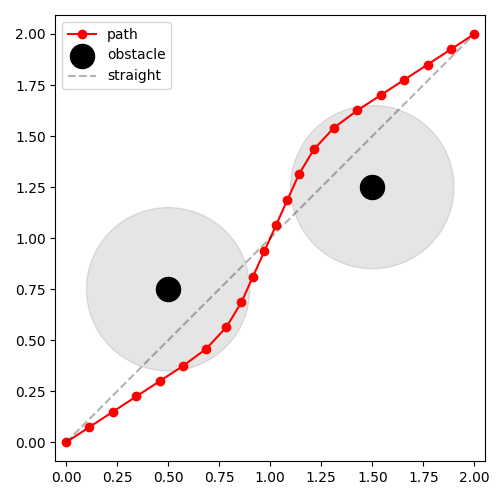
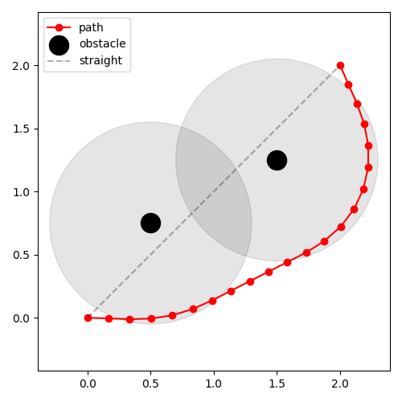
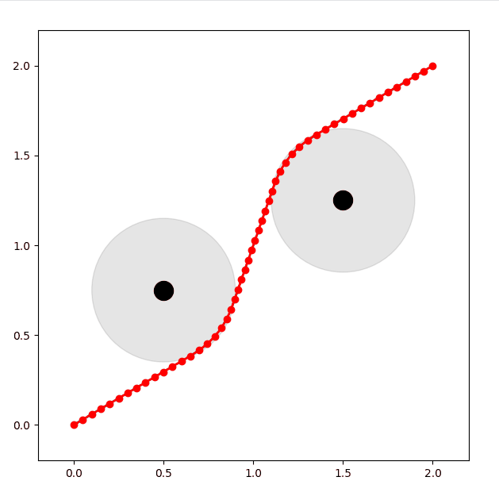

# 问题定义

- 二维空间给定起点和目标点  
  `start_pose = [0, 0]`  
  `end_pose   = [2, 2]`

- 在 `[[0.5, 0.75], [1.5, 1.25]]` 处有两个点障碍  
  `obs_pose = [[0.5, 0.75], [1.5, 1.25]]`

**目标**：求解连接起点与终点且与障碍保持安全距离 `safe_dis = 0.3 m` 的路径点序列

# 问题描述

## 条件  

- 在起点与终点之间插入 `n = 25` 个中间路径点
- 变量维度：`25 × 2 = 50`

## 约束  

1. 路径总长度最短
2. 所有路径点到任何障碍的最小距离 ≥ 0.3 m（可软约束或硬约束）

# 最小二乘格式数学描述

## 变量定义

- 完整轨迹
  
  $$
  \mathbf{X}= \{\mathbf{x}_i\}_{i=0}^{n+1}, \quad \mathbf{x}_i=[x_i,y_i]
  $$

  边界条件  

  $$
  \mathbf{x}_0=[0,0],\quad\mathbf{x}_{n+1}=[2,2]
  $$

- 待优化变量  

  $$
  \mathbf{\Theta} = [\underbrace{x_1,y_1,x_2,y_2,\dots,x_n,y_n}_{2n}]^\top
  $$

## 目标函数

最小化  

$$
\min_{\mathbf{\Theta}}\;
\frac{1}{2}\sum_{i=1}^{n+1}
\Bigl\|\mathbf{x}_i-\mathbf{x}_{i-1}\Bigr\|_2^2
+
\frac{\lambda}{2}\sum_{i=0}^{n+1}
\max\!\bigl(0,\; \text{safe\_dis} - d_{i}\bigr)^2
$$

其中  

$$
d_i=\min_{j}\bigl\|\mathbf{x}_i-\mathbf{o}_j\bigr\|_2,\quad
\mathbf{o}_j\in\text{obs\_pose}
$$

# `code`

完整代码[casdia_solve](code/3_casadi_solve.py)

## 定义问题参数

```python
start_pose = np.array([0.0, 0.0])
end_pose   = np.array([2.0, 2.0])
obs_pose   = np.array([[0.5, 0.75],
                       [1.5, 1.25]])
safe_dis   = 0.4
n          = 20         # 中间点个数
dim        = 2
lambda_pen = 0.5        # 安全距离惩罚权重
```

## 定以决策变量

```python
# 变量向量 X = [x1,y1,x2,y2,...,xn,yn]
X = ca.SX.sym('X', 2 * n)
# 辅助：把向量拆成点序列
pts = [start_pose.reshape(2, 1)]
for k in range(n):
    pts.append(X[2*k:2*k+2])
pts.append(end_pose.reshape(2, 1))
```

## 定义目标函数

```python
obj = 0
# 3.1 路径长度
for i in range(1, len(pts)):
    dist = ca.norm_2(pts[i] - pts[i-1])
    obj += dist**2
# 3.2 安全距离惩罚
for pt in pts:
    dists = [ca.norm_2(pt - obs.reshape(2, 1)) for obs in obs_pose]
    d_min = ca.mmin(ca.vertcat(*dists))
    barrier = ca.fmax(0, safe_dis - d_min)
    obj += lambda_pen * barrier**2
```

## NLP问题求解

```python
nlp = {'x': X, 'f': obj}
opts = {'ipopt.print_level': 0, 'print_time': 0}
solver = ca.nlpsol('solver', 'ipopt', nlp, opts)
```

## 线性插值或者全部插值为起点

```python
def linear_init():
    t = np.linspace(0, 1, n + 2)[1:-1]  # 去掉首尾
    # path = start_pose + t[:, None] * (end_pose - start_pose)
    path = np.tile(start_pose, (n, 1)) # 全部初始化为起点
    return path.flatten()
```

## 求解

```python
# 获取初始值
x0 = linear_init()
# 求解
res = solver(x0=x0,
             lbx=-10, ubx=10)  # 简单上下界
# 获取求解结果
theta_opt = np.array(res['x']).reshape(-1, 2)
```

# 结果

|||
|:--:|:--:|
|`safe_dis=0.3`|`safe_dis=0.8`|

这里其实并没有加相邻路径约束，但是求解的记过仍然很均匀，

这里对两种最短路径做出假设(路径直线长度为$l=2\sqrt{2}$)

- 除起点和终点的其他路径点均位于起点

$$
cost=(0)^2+...+(2\sqrt{2})^2=8
$$

- 所有路径点均匀分布

$$
cost=(\frac{2\sqrt{2}}{n+1})^2\times (n+1)=\frac{8}{n+1}
$$

明显可以看出相邻路径长度平方后，均匀分布反而会有更小的`cost`

## 求解速度

其他条件相同，仅增加路径点数量

|`n`|`casadi`|`least_squares`|
|:--:|:--:|:--:|
|5|5.1ms|0.48s|
|25|11.37ms|21.96s|

基于高效的求解速度，我们甚至可以流畅的进行动态调整

## 一个动态Demo

[casdia_solve_dynamic](code/3_casadi_solve_dynamic.py)

