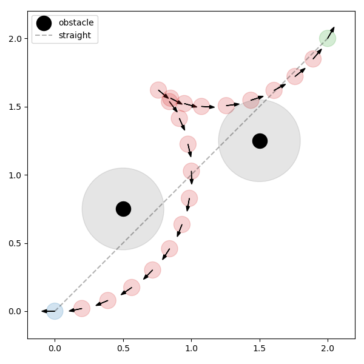
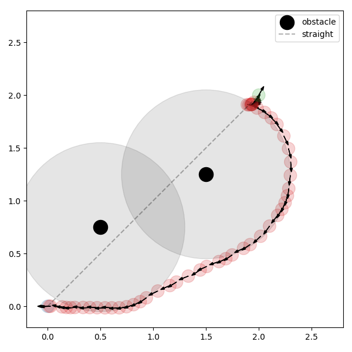
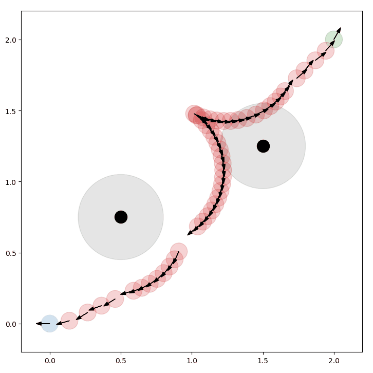

# TEB问题描述

## 问题定义

- 二维空间给定起点和目标点姿态

`Star_PoseSE2 = [0, 0, -pi]`
`End_PoseSE2 = [2, 2, pi/3]`

- 在`[[0.5, 0.75], [1.5, 1.25]]`处有两个点障碍,

`Obs_Pose=[[0.5, 0.75], [1.5, 1.25]]`

- 最大速度限制

$$
v\in[-v_{max},v_{max}]\\
\omega\in[-\omega_{max},\omega_{max}]
$$

- 底盘为 `car_like`模型 [tricycle_dynamics](/Kinetics/tricycle_Kinetics.md)

最小转弯半径为$r_{min}$

**求解连接起点和目标点在与障碍保证安全的前提下, 轨迹长度相对短, 轨迹耗时相对少且符合运动学模型的轨迹序列**

## 问题描述

### 条件

需要在起点和目标点之间生成指定`n`个轨迹点

### 变量定义

- 定义轨迹序列 $\mathbf{X} = \{ \mathbf{x}_i \}_{i=0}^{n+1}$，其中 $\mathbf{x}_i = [x_i, y_i, \theta_i]$ 表示第 $i$ 个轨迹点的位置，满足以下边界条件：

$$
\mathbf{x}_0 = [0, 0, -\pi], \quad \mathbf{x}_{n+1} = [2, 2, \pi/3]
$$

- 定义相邻轨迹点时间差 $\mathbf{T} = \{ \Delta T_i \}_{i=0}^{n}$, 其中 $\Delta T_i$ 表示轨迹点 $\mathbf{x}_i, \mathbf{x}_{i+1}$ 之间的时间差

- 定义障碍序列$\mathbf{O}=\{\mathbf{o}_j \}_{j=0}^m$，其中 $\mathbf{o}_j = [x_j, y_j]$ 表示第 $j$ 个障碍点的位置


### 约束

- **生成的路径点构成的总长度尽量短**

⚠️<font color='pink'>约束的$\mathbf{x}_i$为仅含有$[x,y]$的二维向量</font>

$$
f_{path}(\mathbf{x}_i, \mathbf{x}_{i+1})=||\mathbf{x}_i-\mathbf{x}_{i+1}||_2,\quad i\in[0,1,...,n]
$$

- **轨迹耗时相对短**

$$
f_{T}(\Delta T_i)=\Delta T_i,\quad i\in[0,1,..,n]
$$

- **生成的路径点障碍物保持安全距离**`Safe_Dis = 0.3m`

⚠️<font color='pink'>约束的$\mathbf{x}_i$为仅含有$[x,y]$的二维向量</font>

$$
f_{safe}(\mathbf{x}_i, \mathbf{o}_j)=max \left( 0,Safe\_Dis-||\mathbf{x}_i - \mathbf{o}_j||\right),\quad i\in[1,2,...,n]
$$

> 这里指定 $\mathbf{o}_j$ 为距离轨迹点 $\mathbf{x}_i$ 最近的障碍点

- **生成的相邻轨迹点需要满足最大线速度和角速度要求**

⚠️<font color='pink'>约束的$\mathbf{x}_i$为仅含有$[x,y]$的二维向量</font>

$$
\begin{align}
v_i&=\frac{||\mathbf{x}_{i+1}-\mathbf{x}_i||}{\Delta T_i}\\
\omega_i&=\frac{Normalize(\theta_{i+1}-\theta_i)}{\Delta T_i}\\
i&\in[0,1,...,n]
\end{align}
$$

`Normalize()`将角度差值限制在$[-\pi, \pi]$内

$$
\begin{align}
f_{v}(\mathbf{x}_i, \mathbf{x}_{i+1},\Delta T_i)&=max \left(0, abs(v_i) - v_{max} \right)\\
f_{\omega}(\mathbf{x}_i, \mathbf{x}_{i+1}, \Delta T_i)&=max \left(0, abs(\omega_i) - \omega_{max} \right)\\
i&\in[0,1,...,n]
\end{align}
$$

- **运动学非完整约束**

⚠️<font color='red'>本约束的$\mathbf{x}_i$为仅含有$[x,y,\theta]$的三维向量</font>

[思考(8)李括号, 完整与非完整约束的区别](https://zhuanlan.zhihu.com/p/48662038)

`carlike`和`diff`被视为非完整约束模型，

理论上仅能运行出车身坐标`x`轴向的线段、或者`x`轴向的圆弧，无法在沿着车身`y`轴行进

(<font color='blue'>无法侧着走，仅能直行或固定幅度拐弯</font>)

所以对于生成的相邻的轨迹点，由于两个轨迹点的时间差极小，我们希望这两个轨迹点的姿态尽量在一个圆弧上，如下图


绿色箭头为轨迹点方向向量，黄色实线为相邻两轨迹位置的方向向量，

由几何原理不难得出，当$\beta_k=\beta_{k+1}$即可证明相邻两轨迹点位于同一圆弧上

轨迹点 ($[x,y,\theta]$) 的方向向量可由$\theta$计算得到，方向向量即为两轨迹点位置的差值

$$
\begin{align}
l_k&=[cos\theta_k, sin\theta_k, 0]^T\\
l_{k+1}&=[cos\theta_{k+1}, sin\theta_{k+1}, 0]^T\\
d_{k,k+1}&=[x_{k+1}-x_k, y_{k+1}-y_k, 0]^T
\end{align}
$$

如果$\beta_k=\beta_{k+1}$，则满足以下叉乘

$$
l_k\times d_{k,k+1}=d_{k,k+1}\times l_{k+1}
$$

<font color='blue'>当然，进行优化时大概率等式不成立，所用等号左右两项的差值进行约束, 这样满足约束时不会产生`cost`</font>

所以约束函数定义为(叉乘交换顺序变号)

$$
f_{kinematics}(\mathbf{x}_i,\mathbf{x}_{i+1})=[l_k+l_{k+1}]\times d_{k,k+1},\quad i\in[0,1,...,n]
$$

- 转弯半径约束(针对阿克曼模型)

在速度约束中已经计算的到$v_i,\omega_i$,而且我们已经假设相邻轨迹点在同一圆弧上，所以转弯半径可粗略计算为

$$
r_i=\frac{v_i}{\omega_i},\quad i\in[0,1,...,n]
$$

相应的约束设置为

$$
f_{radius}(\mathbf{x}_i, \mathbf{x}_{i+1}, \Delta T_i)=max \left(0, r_i - r_{min} \right)
$$

## 最小二乘目标函数

最终的目标函数为

$$
\begin{align}
\underset {\mathbf{X},\mathbf{T}}{min} \big\{
&\frac{1}{2}\sum_{i=0}^n f_{path}(\mathbf{x}_i, \mathbf{x}_{i+1})^2\\
+&\frac{1}{2}\sum_{i=0}^n f_{T}(\Delta T_i)^2\\
+&\frac{1}{2}\sum_{i=1}^n f_{safe}(\mathbf{x}_i, \mathbf{o}_j)^2\\
+&\frac{1}{2}\sum_{i=0}^n f_{v}(\mathbf{x}_i, \mathbf{x}_{i+1},\Delta T_i)^2\\
+&\frac{1}{2}\sum_{i=0}^n f_{\omega}(\mathbf{x}_i, \mathbf{x}_{i+1},\Delta T_i)^2\\
+&\frac{1}{2}\sum_{i=0}^n f_{kinematics}(\mathbf{x}_i,\mathbf{x}_{i+1})^2\\
+&\frac{1}{2}\sum_{i=0}^n f_{radius}(\mathbf{x}_i, \mathbf{x}_{i+1}, \Delta T_i)^2
\big\}
\end{align}
$$

### 待求解变量

$\mathbf{X},\mathbf{T}$

## `code`

完整代码[TEB_solve](code/4_TEB_solve.py)

### 定义问题参数

```python
start   = np.array([0.0, 0.0, -np.pi])
end     = np.array([2.0, 2.0, np.pi/3])
obs     = np.array([[0.5, 0.75], [1.5, 1.25]])
n       = 15
vmax    = 1.0
wmax    = 1.5
rmin    = 0.5
safe_dis= 0.3
```

### 定义决策变量

```python
x  = ca.SX.sym('x', n)
y  = ca.SX.sym('y', n)
θ  = ca.SX.sym('θ', n)
ΔT = ca.SX.sym('ΔT', n+1)
# 纵向拼成一维向量
w  = ca.vertcat(x, y, θ, ΔT)
```

### 构造待求解轨迹点集合

```python
pts = [ca.DM(start)]
for k in range(n):
    pts.append(ca.vertcat(x[k], y[k], θ[k]))
pts.append(ca.DM(end))          # 起点/终点是常量，中间是符号变量
```

### 构造目标函数

```python
# ---------- 5. 目标函数 ----------
res = []
for i in range(n+1):
    p0, p1   = pts[i][:2], pts[i+1][:2]
    th0, th1 = pts[i][2], pts[i+1][2]
    seg = ca.norm_2(p1 - p0)
    dt  = ΔT[i]

    # 1. 路径长度
    res.append(seg)
    # 2. 时间
    res.append(dt)
    # 3. 安全距离（仅内部点）
    if 1 <= i <= n:
        dists = [ca.norm_2(pts[i][:2] - o) for o in obs]
        dmin  = ca.mmin(ca.vertcat(*dists))
        res.append(ca.fmax(0, safe_dis - dmin))
    # 4. 速度
    v = seg / (dt + 1e-6)
    res.append(ca.fmax(0, ca.fabs(v) - vmax))
    # 5. 角速度
    dth = norm_angle(th1 - th0)
    ω   = dth / (dt + 1e-6)
    res.append(ca.fmax(0, ca.fabs(ω) - wmax))
    # 6. 非完整运动学
    l0 = ca.vertcat(ca.cos(th0), ca.sin(th0))
    l1 = ca.vertcat(ca.cos(th1), ca.sin(th1))
    d  = p1 - p0
    cross = (l0[0]+l1[0])*d[1] - (l0[1]+l1[1])*d[0]
    res.append(cross)
    # 7. 转弯半径
    r = v / (ca.fabs(ω) + 1e-6)
    res.append(ca.fmax(0, r - rmin))

# *res 是 星号解包（unpacking） 语法
residuals = ca.vertcat(*res)
```

### 求解

```python
res = solver(x0=x0, lbx=-10, ubx=10)
w_opt = np.array(res['x']).flatten()
print('Cost =', float(res['f']))
```

## 结果

|||
|:--:|:--:|
|`safe_dis=0.3`|`safe_dis=0.8`|

在运动学约束下，求解出的轨迹实际上考虑到了方位角和转弯半径。

## 动态DEMO

[TEB_solve_dynamic](code/4_TEB_solve_dynamic.py)

