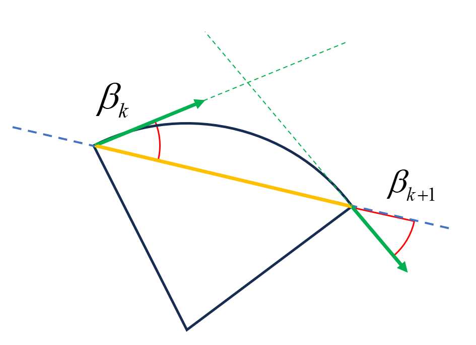
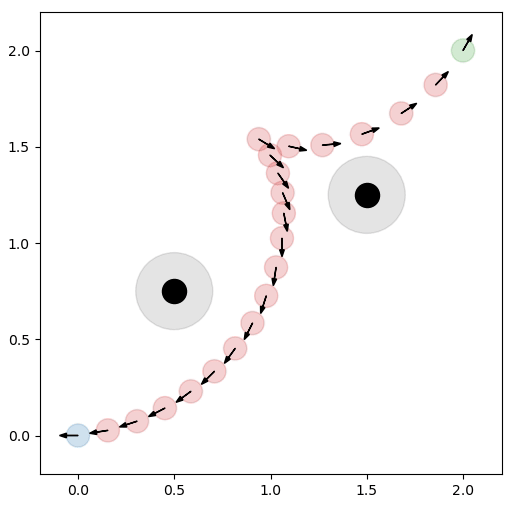

# TEB问题描述

## 问题定义

- 二维空间给定起点和目标点姿态

`Star_PoseSE2 = [0, 0, -pi]`
`End_PoseSE2 = [2, 2, pi/3]`

- 在`[[0.5, 0.75], [1.5, 1.25]]`处有两个点障碍,

`Obs_Pose=[[0.5, 0.75], [1.5, 1.25]]`

- 最大速度限制

$$
v\in[-v_{max},v_{max}]\\
\omega\in[-\omega_{max},\omega_{max}]
$$

- 底盘为 `car_like`模型 [tricycle_dynamics](/Kinetics/tricycle_Kinetics.md)

最小转弯半径为$r_{min}$

**求解连接起点和目标点在与障碍保证安全的前提下, 轨迹长度相对短, 轨迹耗时相对少且符合运动学模型的轨迹序列**

## 问题描述

### 条件

需要在起点和目标点之间生成指定`n`个轨迹点

### 变量定义

- 定义轨迹序列 $\mathbf{X} = \{ \mathbf{x}_i \}_{i=0}^{n+1}$，其中 $\mathbf{x}_i = [x_i, y_i, \theta_i]$ 表示第 $i$ 个轨迹点的位置，满足以下边界条件：

$$
\mathbf{x}_0 = [0, 0, -\pi], \quad \mathbf{x}_{n+1} = [2, 2, \pi/3]
$$

- 定义相邻轨迹点时间差 $\mathbf{T} = \{ \Delta T_i \}_{i=0}^{n}$, 其中 $\Delta T_i$ 表示轨迹点 $\mathbf{x}_i, \mathbf{x}_{i+1}$ 之间的时间差

- 定义障碍序列$\mathbf{O}=\{\mathbf{o}_j \}_{j=0}^m$，其中 $\mathbf{o}_j = [x_j, y_j]$ 表示第 $j$ 个障碍点的位置


### 约束

- **生成的路径点构成的总长度尽量短**

⚠️<font color='pink'>约束的$\mathbf{x}_i$为仅含有$[x,y]$的二维向量</font>

$$
f_{path}(\mathbf{x}_i, \mathbf{x}_{i+1})=||\mathbf{x}_i-\mathbf{x}_{i+1}||_2,\quad i\in[0,1,...,n]
$$

- **轨迹耗时相对短**

$$
f_{T}(\Delta T_i)=\Delta T_i,\quad i\in[0,1,..,n]
$$

- **生成的路径点障碍物保持安全距离**`Safe_Dis = 0.3m`

⚠️<font color='pink'>约束的$\mathbf{x}_i$为仅含有$[x,y]$的二维向量</font>

$$
f_{safe}(\mathbf{x}_i, \mathbf{o}_j)=max \left( 0,Safe\_Dis-||\mathbf{x}_i - \mathbf{o}_j||\right),\quad i\in[1,2,...,n]
$$

> 这里指定 $\mathbf{o}_j$ 为距离轨迹点 $\mathbf{x}_i$ 最近的障碍点

- **生成的相邻轨迹点需要满足最大线速度和角速度要求**

⚠️<font color='pink'>约束的$\mathbf{x}_i$为仅含有$[x,y]$的二维向量</font>

$$
\begin{align}
v_i&=\frac{||\mathbf{x}_{i+1}-\mathbf{x}_i||}{\Delta T_i}\\
\omega_i&=\frac{Normalize(\theta_{i+1}-\theta_i)}{\Delta T_i}\\
i&\in[0,1,...,n]
\end{align}
$$

`Normalize()`将角度差值限制在$[-\pi, \pi]$内

$$
\begin{align}
f_{v}(\mathbf{x}_i, \mathbf{x}_{i+1},\Delta T_i)&=max \left(0, abs(v_i) - v_{max} \right)\\
f_{\omega}(\mathbf{x}_i, \mathbf{x}_{i+1}, \Delta T_i)&=max \left(0, abs(\omega_i) - \omega_{max} \right)\\
i&\in[0,1,...,n]
\end{align}
$$

-  **加速度约束**

设最大线加速度为$va_{max}$

$$
\begin{align}
va_i&=\frac{v_{i+1}-v_i}{0.5(\Delta T_i+\Delta T_{I+1})}\\
\end{align}
$$

约束函数为：

$$
\begin{align}
f_{v_a}(\mathbf{x}_i, \mathbf{x}_{i+1},\mathbf{x}_{i+2},\Delta T_i,\Delta T_{i+1})&=max \left(0, abs(va_i) - va_{max} \right)\\
i&\in[0,1,...,n-1]
\end{align}
$$


- **运动学非完整约束**

⚠️<font color='red'>本约束的$\mathbf{x}_i$为仅含有$[x,y,\theta]$的三维向量</font>

[思考(8)李括号, 完整与非完整约束的区别](https://zhuanlan.zhihu.com/p/48662038)

`carlike`和`diff`被视为非完整约束模型，

理论上仅能运行出车身坐标`x`轴向的线段、或者`x`轴向的圆弧，无法在沿着车身`y`轴行进

(<font color='blue'>无法侧着走，仅能直行或固定幅度拐弯</font>)

所以对于生成的相邻的轨迹点，由于两个轨迹点的时间差极小，我们希望这两个轨迹点的姿态尽量在一个圆弧上，如下图



绿色箭头为轨迹点方向向量，黄色实线为相邻两轨迹位置的方向向量，

由几何原理不难得出，当$\beta_k=\beta_{k+1}$即可证明相邻两轨迹点位于同一圆弧上

轨迹点 ($[x,y,\theta]$) 的方向向量可由$\theta$计算得到，方向向量即为两轨迹点位置的差值

$$
\begin{align}
l_k&=[cos\theta_k, sin\theta_k, 0]^T\\
l_{k+1}&=[cos\theta_{k+1}, sin\theta_{k+1}, 0]^T\\
d_{k,k+1}&=[x_{k+1}-x_k, y_{k+1}-y_k, 0]^T
\end{align}
$$

如果$\beta_k=\beta_{k+1}$，则满足以下叉乘

$$
l_k\times d_{k,k+1}=d_{k,k+1}\times l_{k+1}
$$

<font color='blue'>当然，进行优化时大概率等式不成立，所用等号左右两项的差值进行约束, 这样满足约束时不会产生`cost`</font>

所以约束函数定义为(叉乘交换顺序变号)

$$
f_{kinematics}(\mathbf{x}_i,\mathbf{x}_{i+1})=[l_i+l_{i+1}]\times d_{i,i+1},\quad i\in[0,1,...,n]
$$

- 转弯半径约束(针对阿克曼模型)

在速度约束中已经计算的到$v_i,\omega_i$,而且我们已经假设相邻轨迹点在同一圆弧上，所以转弯半径可粗略计算为

$$
r_i=\frac{v_i}{\omega_i},\quad i\in[0,1,...,n]
$$

相应的约束设置为

$$
f_{radius}(\mathbf{x}_i, \mathbf{x}_{i+1}, \Delta T_i)=max \left(0,  r_{min} - r_i \right)
$$

## 最小二乘目标函数

最终的目标函数为

$$
\begin{align}
\underset {\mathbf{X},\mathbf{T}}{min} \big\{
&\frac{1}{2}\sum_{i=0}^n f_{path}(\mathbf{x}_i, \mathbf{x}_{i+1})^2\\
+&\frac{1}{2}\sum_{i=0}^n f_{T}(\Delta T_i)^2\\
+&\frac{1}{2}\sum_{i=1}^n f_{safe}(\mathbf{x}_i, \mathbf{o}_j)^2\\
+&\frac{1}{2}\sum_{i=0}^n f_{v}(\mathbf{x}_i, \mathbf{x}_{i+1},\Delta T_i)^2\\
+&\frac{1}{2}\sum_{i=0}^n f_{\omega}(\mathbf{x}_i, \mathbf{x}_{i+1},\Delta T_i)^2\\
+&\frac{1}{2}\sum_{i=0}^{n-1}f_{v_a}(\mathbf{x}_i, \mathbf{x}_{i+1},\mathbf{x}_{i+2},\Delta T_i,\Delta T_{i+1})\\
+&\frac{1}{2}\sum_{i=0}^n f_{kinematics}(\mathbf{x}_i,\mathbf{x}_{i+1})^2\\
+&\frac{1}{2}\sum_{i=0}^n f_{radius}(\mathbf{x}_i, \mathbf{x}_{i+1}, \Delta T_i)^2
\big\}
\end{align}
$$

### 待求解变量

$\mathbf{X},\mathbf{T}$

要将当前 **TEB 问题** 转化为一个 **标准非线性规划（NLP）问题**，我们需要将其 **重新格式化为 NLP 的标准形式**：

---

### NLP 标准形式

$$
\begin{aligned}
\min_{\mathbf{z}} \quad & f(\mathbf{z}) \\
\text{s.t.} \quad & g(\mathbf{z}) \leq 0 \\
& h(\mathbf{z}) = 0 \\
& \mathbf{z}_{\text{lb}} \leq \mathbf{z} \leq \mathbf{z}_{\text{ub}}
\end{aligned}
$$

#### 定义优化变量 $\mathbf{z}$

将所有变量拉平为一个向量：

$$
\mathbf{z} = [
\underbrace{x_0, y_0, \theta_0}_{\text{固定}},
\underbrace{x_1, y_1, \theta_1}_{\text{优化变量}},
\dots,
\underbrace{x_n, y_n, \theta_n}_{\text{优化变量}},
\underbrace{x_{n+1}, y_{n+1}, \theta_{n+1}}_{\text{固定}},
\underbrace{\Delta T_0, \dots, \Delta T_n}_{\text{优化变量}}
]
$$

> 注意：起点和终点是固定值，不作为优化变量，但保留在向量中便于索引。

---

#### 将目标函数转化为标量形式

将所有残差项平方和写成单个标量目标函数：

$$
\begin{aligned}
f(\mathbf{z}) = \sum_{i=0}^{n} \{
&w_p \| \mathbf{x}_{i+1} - \mathbf{x}_i \|^2+ w_t \Delta T_i^2+\\
&w_{kin}\big[[l_i+l_{i+1}]\times d_{i,i+1}\big]^2+w_{r}\max(0,r_{min}-r_i)^2
\}
\end{aligned}
$$

#### 将约束分类为等式与不等式

| 原始约束 | NLP 分类 | 建议处理方式 |
|----------|-----------|----------------|
| 起点/终点固定 | **等式约束** | $h(z) = x_0 - [0,0,-\pi] = 0$ |
| 避障 | **不等式约束** | $g(z) = \text{SafeDis} - d_{i,j} \leq 0$ |
| 速度限制 | **不等式约束** | $\|v_i\| \leq v_{\max}$ |
| 角速度限制 | **不等式约束** | $\|\omega_i\| \leq \omega_{\max}$ |
| 加速度限制 | **不等式约束** | $\|va_i\| \leq va_{\max}$ |
| 时间间隔非负 | **边界约束** | $\Delta T_i \in [\Delta T_{min},\Delta T_{max}]$ |

#### 最终 NLP 形式

$$
\begin{aligned}
\min_{\mathbf{z}} \quad & f(\mathbf{z}) \\
\text{s.t.} \quad
& \text{SafeDis} - \|\mathbf{x}_i - \mathbf{o}_j\| \leq 0 \quad \forall i, j \\
& |v_i| \leq v_{\max} \\
& |\omega_i| \leq \omega_{\max} \\
& r_i \geq r_{\min} \\
& |va_i| \leq va_{\max} \\
& f_{\text{kinematics}}(\mathbf{x}_i, \mathbf{x}_{i+1}) = 0 \\
& \mathbf{x}_0 = [0, 0, -\pi] \\
& \mathbf{x}_{n+1} = [2, 2, \pi/3] \\
& \Delta T_i \in [\Delta T_{min},\Delta T_{max}]
\end{aligned}
$$

## `code`

[完整代码](code/4_TEB_solve.py)

### 定义问题参数

```python
n         = 40          # 中间点数
SafeDis   = 0.20        # 安全距离
v_max     = 1.0
omega_max = 1.0
r_min     = 0.5
a_max     = 2.0
epsilon   = 1e-2

w_p = 1.0              # 路径权重
w_t = 0.5               # 时间权重
w_kin = 2.0          # 动力学权重
w_r = 2.0               # 转弯半径约束

# 时间步上下界
T_min = 0.05
T_max = 0.5

# 边界姿态
x0 = [0.0, 0.0, -np.pi]
xf = [2.0, 2.0,  np.pi/3]

# 障碍物
obstacles = np.array([[0.5, 0.75],
                      [1.5, 1.25]])
```

### 定义待求解变量

```python
x     = ca.SX.sym('x', n+2)      # 0..n+1
y     = ca.SX.sym('y', n+2)
theta = ca.SX.sym('theta', n+2)
dt    = ca.SX.sym('dt', n+1)
z = ca.vertcat(x, y, theta, dt)  # 拉平
```

> 将所有变量拉平为一个向量：
> $$
\mathbf{z} = [
\underbrace{x_0, y_0, \theta_0}_{\text{固定}},
\underbrace{x_1, y_1, \theta_1}_{\text{优化变量}},
\dots,
\underbrace{x_n, y_n, \theta_n}_{\text{优化变量}},
\underbrace{x_{n+1}, y_{n+1}, \theta_{n+1}}_{\text{固定}},
\underbrace{\Delta T_0, \dots, \Delta T_n}_{\text{优化变量}}
]
$$

### 目标函数及约束

```python
f = 0
for i in range(n+1):
    dx = x[i+1] - x[i]
    dy = y[i+1] - y[i]
    f += w_p * (dx**2 + dy**2) + w_t * dt[i]**2

# ---------- 约束 ----------
g_eq   = []   # h(z)=0
g_ineq = []   # g(z)≤0

# 1) 边界姿态
g_eq.extend([x[0]-x0[0], y[0]-x0[1], theta[0]-x0[2],
                 x[-1]-xf[0], y[-1]-xf[1], theta[-1]-xf[2]])

# 2) 避障（不等式）
for i in range(1, n+1):                 # 仅中间点
    for ox, oy in obstacles:
        dist = ca.sqrt((x[i]-ox)**2 + (y[i]-oy)**2)
        g_ineq.append(SafeDis - dist)   # ≤0

# 3) 速度、角速度、转弯半径、加速度
for i in range(n+1):
    dx   = x[i+1] - x[i]
    dy   = y[i+1] - y[i]
    dist = ca.sqrt(dx**2 + dy**2)

    v     = dist / (dt[i] + epsilon)
    dth   = ca.atan2(ca.sin(theta[i+1]-theta[i]),
                     ca.cos(theta[i+1]-theta[i]))
    omega = dth / (dt[i] + epsilon)
    radius = v / (ca.fabs(omega) + epsilon)

    # 转弯半径软约束
    f += w_r * ca.fmax(0, r_min - radius)**2
    g_ineq.extend([v - v_max, -v - v_max,
                       omega - omega_max, -omega - omega_max])

    # 加速度（线）
    if i < n:
        dx2   = x[i+2] - x[i+1]
        dy2   = y[i+2] - y[i+1]
        dist2 = ca.sqrt(dx2**2 + dy2**2)
        v2    = dist2 / (dt[i+1] + epsilon)
        acc   = (v2 - v) / (0.5*(dt[i]+dt[i+1]) + epsilon)
        g_ineq.extend([acc - a_max, -acc - a_max])

# 4) 非完整约束（等式）
for i in range(n+1):
    dx   = x[i+1] - x[i]
    dy   = y[i+1] - y[i]
    li   = ca.vertcat(ca.cos(theta[i]),  ca.sin(theta[i]))
    li1  = ca.vertcat(ca.cos(theta[i+1]), ca.sin(theta[i+1]))
    cross = (li[0]+li1[0])*dy - (li[1]+li1[1])*dx
    # g_eq.append(cross)
    f += w_kin * cross**2       # w_kin 为新的权重
```

### 求解器配置及初始化

```python
g = ca.vertcat(*g_eq, *g_ineq)
lbg = [0]*len(g_eq) + [-ca.inf]*len(g_ineq)
ubg = [0]*len(g_eq) + [0]*len(g_ineq)


# ---------- 变量上下界 ----------
lbx = -np.inf*np.ones(z.shape[0])
ubx =  np.inf*np.ones(z.shape[0])

# 固定起点/终点
fix_idx = [0, n+1, n+2, 2*n+3, 2*n+4, 3*n+5]
lbx[fix_idx] = ubx[fix_idx] = [x0[0], xf[0], x0[1], xf[1], x0[2], xf[2]]

# dt 上下界
dt_start = 3*(n+2)
lbx[dt_start:] = T_min
ubx[dt_start:] = T_max

# 初始猜测
z0 = np.zeros(z.shape[0])
# 位置：线性插值
z0[:n+2]   = np.linspace(x0[0], xf[0], n+2)
z0[n+2:2*n+4] = np.linspace(x0[1], xf[1], n+2)
z0[2*n+4:3*n+6] = np.linspace(x0[2], xf[2], n+2)
z0[3*n+6:] = np.ones(n+1)*0.5      # dt

nlp = {'x': z, 'f': f, 'g': g}
opts = {'ipopt.print_level': 0, 'print_time': True}
solver = ca.nlpsol('solver', 'ipopt', nlp, opts)
res = solver(x0=z0, lbg=lbg, ubg=ubg, lbx=lbx, ubx=ubx)
```

## 结果

[交互拖动演示代码](code/4_TEB_solve_dynamic.py)

||
|:--:|
|`n=20`|
