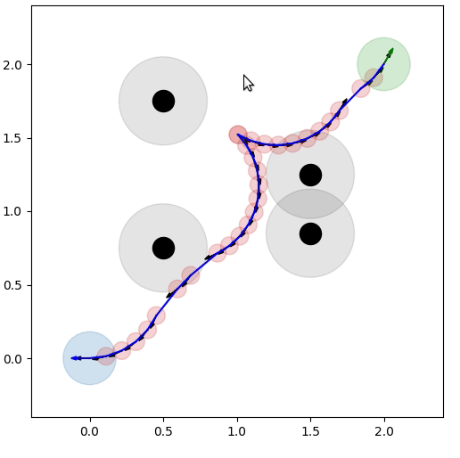

# 求解代码优化

## 添加加速度和抖动约束

[TEB问题描述及求解](4.TEB问题描述及求解.md)中的目标函数为


$$
\begin{align}
\underset {\mathbf{X},\mathbf{T}}{min} \big\{
&\frac{1}{2}\sum_{i=0}^n f_{path}(\mathbf{x}_i, \mathbf{x}_{i+1})^2\\
+&\frac{1}{2}\sum_{i=0}^n f_{T}(\Delta T_i)^2\\
+&\frac{1}{2}\sum_{i=1}^n f_{safe}(\mathbf{x}_i, \mathbf{o}_j)^2\\
+&\frac{1}{2}\sum_{i=0}^n f_{v}(\mathbf{x}_i, \mathbf{x}_{i+1},\Delta T_i)^2\\
+&\frac{1}{2}\sum_{i=0}^n f_{\omega}(\mathbf{x}_i, \mathbf{x}_{i+1},\Delta T_i)^2\\
+&\frac{1}{2}\sum_{i=0}^n f_{kinematics}(\mathbf{x}_i,\mathbf{x}_{i+1})^2\\
+&\frac{1}{2}\sum_{i=0}^n f_{radius}(\mathbf{x}_i, \mathbf{x}_{i+1}, \Delta T_i)^2
\big\}
\end{align}
$$

实际测试中会产生抖动和运动速度突变的情况，所以尝试添加加速度和抖动约束。

### 加速度约束

设最大线/角加速度为$va_{max},\omega a_{max}$

$$
\begin{align}
va_i&=\frac{v_{i+1}-v_i}{0.5(\Delta T_i+\Delta T_{I+1})}\\
\omega a_i&=\frac{\omega_{i+1}-\omega_i}{0.5(\Delta T_i+\Delta T_{I+1})}
\end{align}
$$

约束函数为：

$$
\begin{align}
f_{v_a}(\mathbf{x}_i, \mathbf{x}_{i+1},\mathbf{x}_{i+2},\Delta T_i,\Delta T_{i+1})&=max \left(0, abs(va_i) - va_{max} \right)\\
f_{\omega_a}(\mathbf{x}_i, \mathbf{x}_{i+1},\mathbf{x}_{i+2}, \Delta T_i, \Delta T_{i+1})&=max \left(0, abs(\omega a_i) - \omega a_{max} \right)\\
i&\in[0,1,...,n-1]
\end{align}
$$


## 自适应调整轨迹长度

```python
    def _auto_size(self):
        dist = np.linalg.norm(self.end[:2] - self.start[:2])
        t_min = dist / self.vmax
        self.n = max(4, int(np.ceil(t_min * self.auto_hz)))
        print(f'[Auto] dist={dist:.2f}, t_min={t_min:.2f}, n={self.n}')
```

仅当起点和目标点的变化与原先起点和目标点相比超出阈值范围后

才进行轨迹点数量自动调整

```python
        # 2. 起点 / 终点更新 + 偏差检测
        dirty_n = False
        if start_new is not None:
            start_new = np.asarray(start_new, float)
            if (np.linalg.norm(start_new[:2] - self.start[:2]) > pos_th or
                    abs(np.arctan2(np.sin(start_new[2] - self.start[2]),
                                np.cos(start_new[2] - self.start[2]))) > ang_th):
                self.start = np.copy(start_new) 
                dirty_n = True

        if end_new is not None:
            end_new = np.asarray(end_new, float)
            if (np.linalg.norm(end_new[:2] - self.end[:2]) > pos_th or
                    abs(np.arctan2(np.sin(end_new[2] - self.end[2]),
                                np.cos(end_new[2] - self.end[2]))) > ang_th):
                self.end = np.copy(end_new) 
                dirty_n = True

        # 3. 只有起点/终点变化时才重算 n 并清空上一次解
        if dirty_n:
            self._auto_size()
            self._last_sol = None          # 强制重新生成初值
```

## 软启动

保存上次优化结果,作为本次优化初值,加速求解
(**起点和目标点在允许的变化范围内**)

```python
    def _init_guess(self):
        if self._last_sol is not None:
            return self._last_sol
        n = self.n
        return np.hstack([
            np.linspace(self.start[0], self.end[0], n+2)[1:-1],
            np.linspace(self.start[1], self.end[1], n+2)[1:-1],
            np.unwrap(np.linspace(self.start[2], self.end[2], n+2))[1:-1],
            np.full(n+1, 0.2)
        ])
```

## demo

