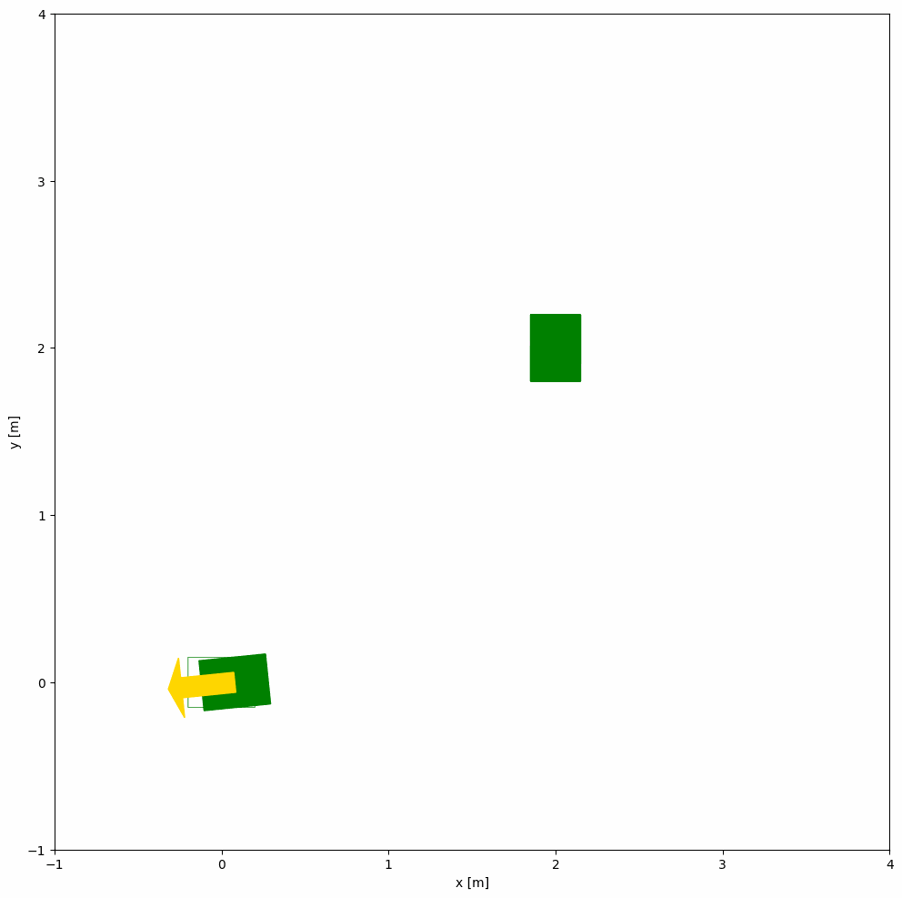

# MPC 求解

## 初始状态&约束

求解 `NLP` 问题

- 起始状态: $\mathrm{x}_s=[0,0,-\pi]^T$, 初始状态: $\mathrm{x}_f=[2,2,\pi]^T$
- 采用差分运动学模型,即[mpc 问题描述](5.mpc问题描述.md)中的运动学方程
- 控制输入限制 $v\in[-0.5,0.5],w\in[1.0,1.0]$, 单位分别是$m/s,rad/s$
- $N=100$
- 由于时间差相等，令$\Delta t = 0.1$
- 运动学约束

  $$
  \begin{align}
  \phi(\mathrm{x}[k+1], \mathrm{x}[k], \mathrm{u}[k], \Delta t_k)=\frac{\mathrm{x}[k+1]- \mathrm{x}[k]}{\Delta t}-f\big(\mathrm{x}[k], \mathrm{u}[k]\big)
  \end{align}
  $$

这里需要注意

[单重打靶（single shooting） vs 多重打靶（multiple shooting） vs collocation](https://zhuanlan.zhihu.com/p/1937828062696825380)

代码中使用的是 `multiple shooting`

## code

[5_mpc_solve.py](code/5_mpc_solve.py)

**运动学模型**

$$
\begin{align}
\dot{x}&=vcos\theta\\
\dot{y}&=vsin\theta\\
\dot{\theta}&=\omega\\
\end{align}
$$

```python
    def _build_kinematic_model(self):
        """构建车辆运动学模型"""
        x = ca.SX.sym('x')
        y = ca.SX.sym('y')
        theta = ca.SX.sym('theta')
        states = ca.vertcat(x, y, theta)

        v = ca.SX.sym('v')
        omega = ca.SX.sym('omega')
        controls = ca.vertcat(v, omega)

        # 连续时间运动学方程
        rhs = ca.vertcat(
            v * ca.cos(theta),
            v * ca.sin(theta),
            omega
        )

        # 状态转移函数
        self.f = ca.Function('f', [states, controls], [rhs])
```

**构造目标函数**

$$
\begin{align}
J_f\big(\mathrm{x[N]}\big)&=(\mathrm{x}[N]-\mathrm{x}_f)^T\mathrm{Q}_f(\mathrm{x}[N]-\mathrm{x}_f)\\
l\big(\mathrm{x}[k],\mathrm{u}[k]\big)&=(\mathrm{x}[k]-\mathrm{x}_f)^T\mathrm{Q}(\mathrm{x}[k]-\mathrm{x}_f)+\mathrm{u}[k]^TR\mathrm{u}[k]\\
\end{align}
$$

```python
        # 构建目标函数
        obj = 0
        for i in range(self.N):
            # 阶段代价
            state_error = X[:, i] - P[self.n_states:]
            obj += ca.mtimes([state_error.T, self.Q, state_error])
            obj += ca.mtimes([U[:, i].T, self.R, U[:, i]])

        # 终端代价
        final_error = X[:, -1] - P[self.n_states:]
        obj += ca.mtimes([final_error.T, self.Qf, final_error])
```

**运动学约束**

$$
\begin{align}
 &\mathrm{x}[0]=\mathrm{x}_s,\quad\mathrm{x}[N]=\mathrm{x}_f\\
&\phi(\mathrm{x}[k+1], \mathrm{x}[k], \mathrm{u}[k], \Delta t_k)=\frac{\mathrm{x}[k+1]- \mathrm{x}[k]}{\Delta t_k}-f\big(\mathrm{x}[k], \mathrm{u}[k]\big)
\end{align}
$$

```python
        g = [X[:, 0] - P[:self.n_states]]  # 初始状态约束 g=0
        g.append(X[:, -1] - P[self.n_states:])  # 终端状态约束（强制最后到达目标）

        for i in range(self.N):
            # 运动学约束 (欧拉离散) g = 0
            x_b = (X[:, i+1] - X[:, i])/ self.T - self.f(X[:, i], U[:, i])
            g.append(x_b)
```

## demo



## 参考

- [An Introduction to Trajectory Optimization: How to Do Your Own Direct Collocation](https://epubs.siam.org/doi/epdf/10.1137/16M1062569)
