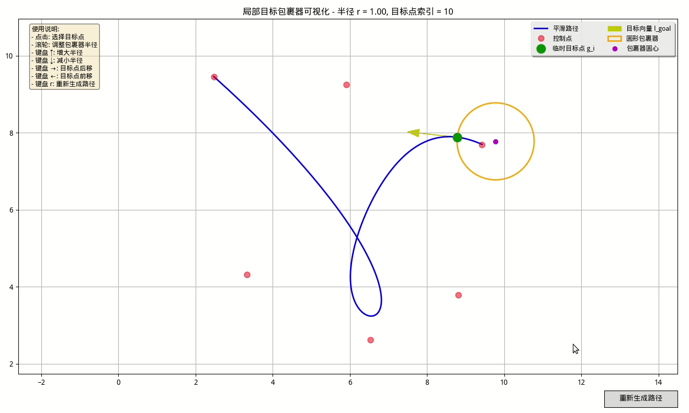

# 局部目标包裹器

## 描述

- 已有一条路径 $p=\{[x_0,y_0],...,[x_n,y_n]\}$
- 截取路径 $p$处某一点作为临时目标点$g_{i}=[x_i,y_i], i\in[0,...,n-1]$

根据 $g_{i}=[x_i,y_i]$ 的相邻路径点 $g_{i+1}=[x_{i+1},y_{i+1}]$，计算 $g_i$处的临时目标向量

$$
l_{goal}=norm(g_{i+1}-g_i)
$$

> norm()为单位化向量作用

## 包裹器

要求 $l_{goal}$ 为包裹器圆心射向圆外的某一向量，即包裹器圆心在 $l_{goal}$ 所在的直线上，

现在假设包裹器半径为 $r$, 圆形目标包裹器的圆心 $[x_w,y_w]$ 可按照以下方式求得

$$
   [x_w, y_w] = g_i + l_{goal} \cdot r = \left[ x_i - \frac{x_{i+1} - x_i}{d} \cdot r, \ y_i - \frac{y_{i+1} - y_i}{d} \cdot r \right]
$$

$$
   \boxed{[x_w, y_w] = g_i - r \cdot l_{goal}}
$$

## DEMO

