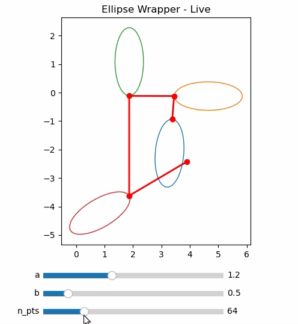

# 局部目标包裹器

## 描述

- 已有一条路径 $p=\{[x_0,y_0],...,[x_n,y_n]\}$
- 截取路径 $p$处某一点作为临时目标点$g_{i}=[x_i,y_i], i\in[0,...,n-1]$

根据 $g_{i}=[x_i,y_i]$ 和 当前机器人位置 $p_r = [x_r,y_r]$，计算 $g_i$ 到 $p_r$ 处的距离和水平轴的夹角

$$
\begin{align}
l_{r}&=||g_{i}-p_r||_2\\
\theta_r&=atan2(y_r-y_i,x_r-x_i)
\end{align}
$$

计算 $g_i$ 处的单位方向向量$\vec{l}$(由 $g_{i+1}$ 与 $g_i$确定)与水平轴的夹角

$$
\theta_g=atan2(y_{i+1}-y_i,x_{i+1}-x_i)\\
\vec{l}=[cos\theta_g,\sin\theta_g]
$$

`norm()`代表单位化该向量，$\gamma$ 代表 $\vec{l}$ 与水平轴的夹角

## 包裹器

包裹器为以椭圆，$a,b$分别为$l_r$在$-\vec{l}$和$-\vec{l}_ \bot$方向上的分量

$$
\begin{align}
a&=\alpha \cdot l_rcos(\theta_r-\theta_g)\\
b&=\alpha \cdot l_rsin(\theta_r-\theta_g)
\end{align}
$$

其中 $\alpha$ 为包裹系数。

把 $g_i$ 沿 $-\vec{l}$ 方向平移 $a$ 即可得到圆心：

$$
C = [x_r,y_r] = g_i - a \cdot \vec{l}
$$

包裹器圆方程为

$$
\begin{aligned}
\begin{cases}
x(\theta) = x_C + a \cdot \cos\theta \cdot \cos\theta_g - b \cdot \sin\theta \cdot \sin\theta_g \\
y(\theta) = y_C + a \cdot \cos\theta \cdot \sin\theta_g + b \cdot \sin\theta \cdot \cos\theta_g
\end{cases}, \quad \theta \in [0, 2\pi]
\end{aligned}
$$

$\theta\in [0,2\pi]$ 为旋转半径与水平轴的夹角

###

## 圆形包裹 $\rightarrow$ 椭圆包裹

把椭圆包裹器改成**极坐标形式**（仍保持长轴沿路径切线方向、短轴沿法线方向），只需把椭圆方程写成以 $g_i$ 为原点、以 $l_{\text{goal}}$ 为极轴的极坐标方程即可。

---

### 1. 极坐标定义
- 原点：当前局部目标点 $g_i = (x_i,y_i)$  
- 极轴：单位切向量 $l_{\text{goal}} = (\cos\theta,\sin\theta)$，其中  

$$
  \theta = \arctan2(y_{i+1}-y_i,\,x_{i+1}-x_i)
$$

- 椭圆参数：长轴半长 $a$（沿极轴方向），短轴半长 $b$（垂直极轴方向）。

---

### 2. 椭圆圆心

$$
 W = [x_w,y_w] = g_i - a\cdot l_{\text{goal}}
$$

### 3. 椭圆极坐标方程
以 $W$ 为原点的椭圆极坐标方程为  

$$
\boxed{
\rho(\varphi) = \frac{a\,b}{\sqrt{b^2\cos^2\varphi + a^2\sin^2\varphi}}
}
$$
- $\varphi$ 为相对极轴 $l_{\text{goal}}$ 的极角 $\varphi=0$即沿切线方向。  
- $\rho(\varphi)$ 为从 $W$ 到椭圆边界的有向距离。  

---

### 4. 换回笛卡尔坐标
若需要把极坐标 $(\rho,\varphi)$ 转回世界坐标 $(x,y)$：

$$
\begin{aligned}
x &= x_w + \rho\,\cos(\theta+\varphi) \\
y &= y_w + \rho\,\sin(\theta+\varphi)
\end{aligned}
$$

### 5.包裹器输入输出

#### **输入**
- 几何参数  
  \( a > 0 \) — 椭圆长轴半长（沿切线方向）  
  \( b > 0 \) — 椭圆短轴半长（沿法线方向）

- 路径信息  
  $ g_i = [x_i, y_i] $ — 当前局部目标点  
  $ l_{\text{goal}} = [\cos\theta, \sin\theta] $ — 单位切向量（已归一化）

- 极角采样  
  $ \varphi \in [0,\,2\pi) $ — 相对于切线方向的极角

---

#### **输出**  
对任意给定的 $ \varphi $，计算包裹器边界点坐标：

1. 椭圆中心  

$$
[x_w,\,y_w] = [x_i,\,y_i] - a \cdot [\cos\theta,\,\sin\theta]
$$

2. 极径（从中心到边界的距离） 

$$
\rho(\varphi) = \frac{a\,b}{\sqrt{b^{2}\cos^{2}\varphi + a^{2}\sin^{2}\varphi}}
$$

3. 世界坐标  

$$
\boxed{
\begin{aligned}
x(\varphi) &= x_w + \rho(\varphi)\,\cos(\theta+\varphi) \\[4pt]
y(\varphi) &= y_w + \rho(\varphi)\,\sin(\theta+\varphi)
\end{aligned}
}
$$

## DEMO

