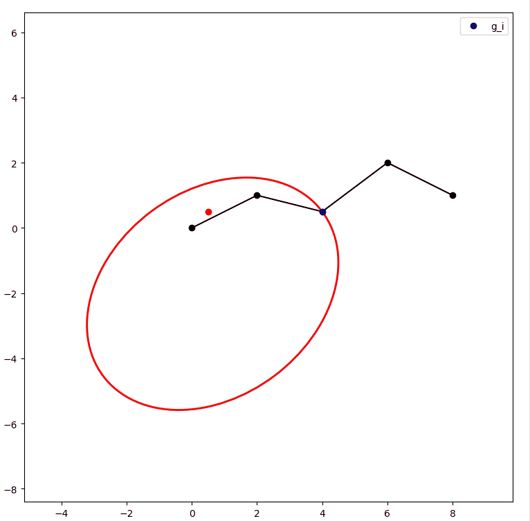

# 局部目标包裹器

## 描述

- 已有一条路径 $p=\{[x_0,y_0],...,[x_n,y_n]\}$
- 截取路径 $p$处某一点作为临时目标点$g_{i}=[x_i,y_i], i\in[0,...,n-1]$

根据 $g_{i}=[x_i,y_i]$ 和 当前机器人位置 $p_r = [x_r,y_r]$，计算 $g_i$ 到 $p_r$ 处的距离和水平轴的夹角

$$
\begin{align}
l_{r}&=||g_{i}-p_r||_2\\
\theta_r&=atan2(y_r-y_i,x_r-x_i)
\end{align}
$$

计算 $g_i$ 处的单位方向向量$\vec{l}$(由 $g_{i+1}$ 与 $g_i$确定)与水平轴的夹角

$$
\theta_g=atan2(y_{i+1}-y_i,x_{i+1}-x_i)\\
\vec{l}=[cos\theta_g,\sin\theta_g]
$$

`norm()`代表单位化该向量，$\gamma$ 代表 $\vec{l}$ 与水平轴的夹角

## 包裹器

包裹器为以椭圆，$a,b$分别为$l_r$在$-\vec{l}$和$-\vec{l}_ \bot$方向上的分量

$$
\begin{align}
a&=\alpha \cdot l_rcos(\theta_r-\theta_g)\\
b&=\alpha \cdot l_rsin(\theta_r-\theta_g)
\end{align}
$$

其中 $\alpha$ 为包裹系数。

把 $g_i$ 沿 $-\vec{l}$ 方向平移 $a$ 即可得到圆心：

$$
C = [x_r,y_r] = g_i - a \cdot \vec{l}
$$

包裹器圆方程为

$$
\begin{aligned}
\begin{cases}
x(\theta) = x_C + a \cdot \cos\theta \cdot \cos\theta_g - b \cdot \sin\theta \cdot \sin\theta_g \\
y(\theta) = y_C + a \cdot \cos\theta \cdot \sin\theta_g + b \cdot \sin\theta \cdot \cos\theta_g
\end{cases}, \quad \theta \in [0, 2\pi]
\end{aligned}
$$

$\theta\in [0,2\pi]$ 为旋转半径与水平轴的夹角

## DEMO

